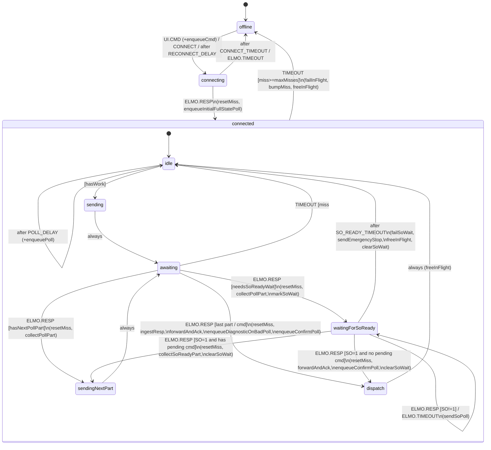

# XState-машина транспорта ELMO — фича и план

## Актуализация 2026-06-08: граница с remote-control

Production Dashboard-команды теперь могут проходить через remote-control `CommandGate` до попадания в `CommandHandler`. Это верхнеуровневый gate для ownership local/remote и UI display-only; он не меняет контракт транспорта `CommandHandler -> ELMO XState (UDP) -> ResponseParser` и не должен добавлять параллельных владельцев UDP-канала.

## Актуализация 2026-06-01: сценарии и low-resolution speed

`ScenarioManager` реализован и подключен к production-flow. Он использует тот же путь команд, что и ручное управление: `CommandHandler -> ELMO XState (UDP) -> ResponseParser`. Сценарии читаются из `C:\NC3\scenarios`, нормализуются через `nc3.normalizeScenario`, выполняются шаг за шагом через `set_jv`, при необходимости переключают `OL[1]` через `set_resolution` и запускают `Drive Init`, затем продолжают текущий шаг.

Скорость для критерия готовности теперь берется из `payload.velocity_deg_per_sec`. В `high` это значение обычно основано на `VX`, а в `low` при наличии буфера выбирается оценка `PX/TM`, чтобы убрать скачки `VX` на малых скоростях. Raw data poll по-прежнему пишет только `TM/PX`.

Timeout ожидания скорости считается не от старта сценарного шага, а от ACK команды `set_jv`: `abs(targetSpeed)/AC + 10 с`. Время смены разрешения и `Drive Init` в этот timeout не входит.

## Актуализация 2026-05-29: сценарии поверх транспорта

К транспортной машине добавлен сценарный потребитель, но сам транспорт остался единственным владельцем UDP-канала. `ScenarioManager` живет в `BUN flow`, получает команды UI `scenario_start`/`scenario_stop`, читает `.scn` файл, формирует шаги через `nc3.normalizeScenario`, а затем кладет обычные UI-команды в существующий `CommandHandler`. За счет этого сценарии используют тот же путь, что и ручное управление: валидация диапазонов, пересчет тиков, атомарная очередь UDP и `ResponseParser`.

Критерий готовности шага вынесен из сценарного файла в настройки ПО: `settings.general.speedReadyTolerancePercent` (0..100 %) плюс время устойчивости `advanced.speedStableTimeMs`. Timeout текущей реализации стартует после ACK `set_jv` и вычисляется как `abs(targetSpeed)/AC + 10 с`; `advanced.speedReachTimeoutMs` остался fallback-настройкой evaluator-а.

Poll-контракт уточнен: обычный режим больше не зависит от скорости и работает 2 Гц, быстрый raw-режим включается только на время записи raw-данных и читает только `TM/PX`. Это сохраняет data-файл чистым временным рядом угловых меток, а скорость для `Готов` берется из обычного `TM/PX/VX` до начала записи шага.

Актуально на: 2026-06-08.

Документ описывает фичу «единая XState-машина транспорта ELMO» целиком: зачем она нужна, какие архитектурные решения принимались по ходу стендовой отладки и какой получился финальный дизайн. Текущее состояние реализации — [xstate-elmo-status.md](xstate-elmo-status.md). Краткая карта файлов и функций — [xstate-elmo-files.md](xstate-elmo-files.md).

## 1. Цель и контекст

Привод центрифуги (`ELMO`, `192.168.1.2`) общается с Node-RED по сетевому текстовому протоколу `Direct Access`. До этой фичи в `flows.json` (`new ui flow`) было **пять параллельных `tcp request`-узлов** на тот же endpoint в режиме `out:"time"`, плюс размазанная по разным `function`/`switch`/`change` логика опроса и команд. Это давало:

- TCP-race при одновременных запросах от разных частей flow;
- нестабильный 1 Гц poll и невозможность поднять частоту;
- отсутствие явных состояний привода и подтверждений команд.

Целевая задача — **30 точек на оборот при максимальной угловой скорости 48 °/с** (8 об/мин, head `high`), т.е. ~4 Гц полезного сэмпла. Фактическая целевая частота транспорта — до 30 Гц для запаса по oversampling.

Фича — это один сериализованный владелец канала к ELMO с явными состояниями, единой очередью команд/poll, самотактируемым опросом, без потери совместимости с существующим `ResponseParser`/UI.

## 2. История решений (стендовая отладка)

Финальный дизайн получился не сразу. Каждое из решений ниже было принято/отменено по результату замера на стенде с реальным ПЛК.

### Этап 0: первоначальный план (TCP `sit` + FrameSplitter, multi-part)

Изначально транспорт делался поверх одного `tcp request` в режиме `sit` (keep-open). Поскольку TCP — поток байт, для разбиения ответов на кадры использовался `FrameSplitter` с idle-gap (`80 мс` тишины = конец кадра). Каждый логический poll слался как **серия одиночных read-команд** (`TM`, `PX`, `VX`), потому что батч `TM;PX;VX;` давал склеенные ответы.

**Замер:** при `fastRawPollHz=30` фактически получалось `~3.2 Гц`. Потолок:

```
ceiling ≈ 1 / (N_commands × idle_gap_ms)
       = 1 / (3 × 0.08) ≈ 4 Гц
```

Потолок — это плата за idle-gap. Уменьшать `idle-gap` рискованно (риск ранне-обрезанных кадров). Решение: уйти от TCP/idle-gap.

### Этап 0.5: UDP с батч-командой (откат)

Гипотеза: по UDP датаграмма = готовый кадр, и если слать батч `TM;PX;VX;` одной датаграммой — ELMO ответит одной датаграммой со всеми значениями, не нужен ни `FrameSplitter`, ни idle-gap.

**Замер на стенде показал обратное:** в логе посыпались `POLL.BAD_FRAME` вида:

```
cmd: "MO;SO;SR;"   raw: "PX;-6.691000e+03;"
cmd: "TM;PX;VX;"   raw: "TM;925007582;"
```

— ELMO **отвечает одной датаграммой на каждый параметр**, не объединяя. Хуже того, при единственном in-flight остатки от предыдущего батча мис-атрибутировались следующему запросу (на `MO;SO;SR;` приходил остаточный `PX;...`). Гипотеза отвергнута.

### Этап 0.75: UDP + атомарные команды (принято)

Решение: каждый логический poll — это **последовательность атомарных одно-параметровых команд** (`TM`, потом `PX`, потом `VX`), каждая → ровно одна датаграмма-ответ (1:1 корреляция). Транспорт собирает части в один логический raw для downstream-парсера. На UDP idle-gap не нужен — датаграмма уже кадр. Каждая часть валидируется по ожидаемому параметру (`partRequired`), любая «чужая» датаграмма → `POLL.BAD_FRAME` для этой части, логический poll переотправится на следующем тике.

**Замер:** `~22–25 Гц` при цели 30 Гц. `POLL.BAD_FRAME` нет. Хорошо, но 30 не дотянули.

### Этап 1.0: компенсация Windows-таймера (принято)

Анализ остатка показал: дело не в ELMO/UDP, а в гранулярности `setTimeout` Node-RED на Windows (~`15.625 мс`). Цикл fast-poll на 30 Гц:

```
target_ms      = 33 мс
RTT (3 атомарных) ≈ 15 мс
POLL_DELAY     = 33 − 15 = 18 мс
setTimeout(18) → ВТОРОЙ тик ≈ 31 мс (округление вверх)
цикл           ≈ 15 + 31 = 46 мс → ~22 Гц
```

Решение: ввести `pollOptions.timerCompensationMs` (~8 мс = половина тика). Запрос 18 → 10 мс < тика → ПЕРВЫЙ тик ≈ 15.6 мс, цикл ~30.6 мс → ~32 Гц. Один тик сэкономлен за цикл.

**Замер:** `~30–32 Гц` при цели 30 Гц. Цель достигнута. Аналогично 10 Гц поднялся с ~9.2 до ~10.3 Гц.

## 3. Финальная архитектура

### 3.1 Принципы

- **Один сетевой владелец.** Все исходящие команды к ELMO идут через одну XState-машину и один `udp out`. Внешние клиенты (UI, сценарий, periodic poll) пишут в очередь через события `UI.CMD`/`POLL.*`.
- **Single in-flight, 1:1 корреляция.** `udp out`/`udp in` не парные. Чтобы привязать ответ к запросу, в любой момент времени в линии только один запрос; следующий уйдёт после ответа/таймаута на текущий.
- **Атомарные команды.** Каждый poll — список однопараметровых read-команд (`cmds[]`); реассемблируется в один логический raw на dispatch.
- **Soft timeout recovery.** UDP — connectionless. Один пропущенный ответ освобождает in-flight и возвращает в `idle`; `offline` только после `maxMisses` подряд пропусков, затем self-heal через `RECONNECT_DELAY`.
- **Чистый машинный код.** Весь ввод-вывод вынесен в инъектируемые `effects`. Машина юнит-тестируется через `node --test` без Node-RED.
- **Не дублирует `ResponseParser`.** Транспорт пересылает сырой склеенный ответ дальше с восстановленным `topic`; собственный минимальный парсер `parseElmoScalars` нужен только для решений транспорта (динамическая частота, fast-стабильность).

### 3.2 Компоненты

```
+-----------------------------------------+
| Node-RED tab "ELMO XState (UDP)"        |
|                                         |
|  inject/UI ─┐                           |
|             ▼                           |
|       [Function: ElmoTransport]         |
|        ▲  │ out0 (cmd)   │ out1 (raw)   |
|        │  ▼              ▼              |
|        │  [udp out :5001]  [debug/parser]
|        │       │           │ out2 (events)
|        │       ▼           ▼            |
|        │     ELMO        [debug/meter]  |
|        │       │                        |
|        │       ▼                        |
|        │  [udp in :5005]                |
|        │       │                        |
|        │       ▼                        |
|        │  [change: elmo_raw=true]       |
|        └───────┘                        |
+-----------------------------------------+

External package: packages/nc3-elmo-machines/
  • src/elmoTransport.js    — XState-машина
  • src/poll.js             — построение poll, расчёт частоты
  • src/parse.js            — минимальный парсер
  • src/queue.js            — приоритетная очередь
  • src/res.js              — разрешения энкодера
  • src/util.js             — мелочи
Загружается в Node-RED через functionGlobalContext → global.get('nc3').
```

### 3.3 Контракты

#### Эффекты (DI)

| Эффект | Назначение | Дефолт |
|---|---|---|
| `sendCmd(cmd)` | Отправить одну командную датаграмму. | no-op |
| `forwardResp(raw, topic)` | Переслать сырой склеенный ответ в `ResponseParser`/debug с восстановленным topic. | no-op |
| `emitEvent(evt)` | Доменное событие (`CMD.ACKED/FAILED`, `POLL.BAD_FRAME`). | no-op |
| `setStatus(st)` | `node.status({fill,shape,text})`. | no-op |
| `now()` | Часы. Инъектируемы в тестах. | `Date.now` |
| `timeoutMs` | Watchdog ожидания ответа на запрос. | `1000` |
| `connectTimeoutMs` | Watchdog ответа на probe в `connecting`. | `2000` |
| `reconnectMs` | Пауза `offline` перед повторным probe. | `1000` |
| `maxMisses` | Сколько подряд таймаутов до `offline`. | `3` |
| `statePeriodMs` | Минимальный период state-poll. | `1000` |
| `probeCmd` | Команда liveness-probe на connect. | `'TM'` |
| `initialFullState` | Ставить ли full-state poll после connect. | `true` |
| `pollOptions.minHz` / `.maxHz` | Границы velocity-derived rate. | `1` / `30` |
| `pollOptions.analogParam` | Опц. параметр для full-state poll (давление). | `undefined` |
| `pollOptions.timerCompensationMs` | Компенсация Windows-тика для `POLL_DELAY`. | `0` (Node-RED-обвязка ставит `8`). |

`input`: `{ resolution: 'high'|'low', pollConfig: {...} }`.

#### Входные события (UI/сценарий → машина)

| Событие | Семантика |
|---|---|
| `UI.CMD` | `{ envelope: { id?, kind: 'cmd'\|'tilt', cmd, meta: { topic, setpointDegS? } } }` — пользовательская/сценарная команда. |
| `POLL.TICK` | Внеплановый запуск poll. |
| `POLL.FULL_STATE` | Запросить full-state poll один раз. |
| `POLL.CONFIG` | `{ config: { isRecording, isRecordingRaw, rawDataEnabled, fastRawPollHz, ... } }` — переключить fast-raw режим. |
| `CONNECT` | Перейти в `connecting` (отправить probe). |
| `ELMO.RESP` | `{ raw: string }` — пришла датаграмма от ELMO. |
| `ELMO.TIMEOUT` | Принудительный таймаут (для тестов/внешнего watchdog). |
| `CLEARED` | Принудительный выход из (исторический) `fault`; в UDP-машине не используется. |

#### Исходящие доменные события (`emitEvent`)

| Событие | Когда |
|---|---|
| `CMD.ACKED` | Получен ответ на ackable-команду (`kind: 'cmd'\|'tilt'`). `{ id, raw }`. |
| `CMD.FAILED` | Таймаут на ackable-команде. `{ id, reason: 'timeout' }`; отдельный случай после `MO=1` — `{ reason: 'so_timeout' }`, если `SO` не стал `1` за `soReadyTimeoutMs`. |
| `POLL.BAD_FRAME` | Атомарная часть/целый кадр poll не прошли валидацию. `{ id, role, missing, part?, cmd, raw }`. |

### 3.4 Полная state-диаграмма



Глобальные обработчики (на любом состоянии):

| Событие | Действие | Где |
|---|---|---|
| `POLL.CONFIG` | `configurePoll` | root |
| `UI.CMD` | `enqueueCmd` | в `offline`, `connecting`, `connected` |
| `POLL.TICK` | `enqueuePoll` | только в `connected` |
| `POLL.FULL_STATE` | `enqueueFullStatePoll` | только в `connected` |

`entry`-действия по состояниям:

| Состояние | Entry |
|---|---|
| `offline` | `statusOffline` |
| `connecting` | `statusConnecting`, `sendProbe` |
| `connected.idle` | `statusIdle` |
| `connected.sending` | `statusBusy`, `takeNext`, `sendInFlight` |
| `connected.waitingForSoReady` | `statusWaitingSo`, `sendSoPoll` |
| `connected.sendingNextPart` | `sendInFlight` (следующая `cmds[cursor]`) |
| `connected.dispatch` | `freeInFlight` |

### 3.5 Очередь и приоритеты

Единая сериализованная priority-queue, стабильный FIFO внутри приоритета.

| Роль (`kind`) | Приоритет |
|---|---:|
| `cmd` / `init` | 3 |
| `fastPoll` (fast_data) | 2.5 |
| `tilt` | 2 |
| `poll` (data/state/full_state) | 1 |

Команда всегда вытесняет очередной poll; fast-poll вытесняет обычный poll. `enqueuePoll` дедуплицирует по роли — двух одинаковых poll в очереди не будет.

### 3.6 Poll-роли и команды

| Роль | `cmds` | `topic` (наружу) | Когда |
|---|---|---|---|
| `data` | `TM`, `PX`, `VX` | `poll_data` | Базовый поток данных. |
| `state` | `MO`, `SO`, `SR` | `poll_state` | ≥1 раз в `statePeriodMs`. |
| `full_state` | `MS`, `MO`, `SO`, `SR`, `AF`, `OL[1]`, `OL[2]` (+ `analogParam`) | `poll_state` | После connect, ручной запрос, диагностика при `POLL.BAD_FRAME`. |
| `fast_data` | `TM`, `PX` | `poll_data` | Запись исходных угловых/временных меток. |

### 3.7 Самотактируемая частота

`computePollDelayMs(context, options)`:

- В fast-raw режиме: `target_ms = 1000 / fastRawPollHz`, `delay = max(1, round(target_ms − elapsed_since_lastFastPollStartedAt − timerCompensationMs))`.
- В normal режиме: `rate = normalPollHz` (по умолчанию 2 Гц); `delay = max(1, round(1000/rate − timerCompensationMs))`.

`omegaSource = 'setpoint'` сохраняется в контексте как подсказка для внешних потребителей, но текущая частота normal-poll больше не зависит от скорости.

### 3.8 Fast raw recording mode

Активируется через `POLL.CONFIG`, активен пока:

```
fastRawPollingEnabled === true
isRecording === true
isRecordingRaw === true
rawDataEnabled === true
```

Параметры: `fastRawPollHz` (1–30). Legacy-параметры `fastStableSamples` и `fastStableToleranceTicks` больше не выбирают состав fast-poll.

Сценарий: достижение скорости определяется до начала выдержки по обычному `poll_data` (`TM/PX/VX`) и процентной настройке `speedReadyTolerancePercent`. После старта записи raw fast-poll всегда читает только `TM/PX`; невалидный fast-кадр → `POLL.BAD_FRAME` + `full_state` poll с приоритетом `init` для диагностики.

### 3.9 Подтверждение состояния после команды

После ackable-команды, меняющей стабильное состояние привода, ставится подтверждающий poll:

| Команда | Подтверждающий poll |
|---|---|
| `MO=…` | `state` (MO/SO/SR) |
| `OL[1]=…` | `full_state` |
| `OL[2]=…` | `full_state` |
| `AF=…` | `full_state` |
| (любая) `meta.confirmPollRole` | как задано |

## 4. Node-RED интеграция

Вкладка `ELMO XState (UDP)` в `flows.json`. Узлы:

- `ElmoTransport` (function, 3 выхода: cmd / resp / events). `initialize` создаёт `nc3.startElmoTransport(...)` с эффектами; `finalize` останавливает actor.
- `udp out` → `192.168.1.2:5001`, локальный bind `:5005`.
- `udp in` → `:5005` → `change: msg.elmo_raw=true` → обратно во вход транспорта.
- Тестовые inject-узлы: `manual cmd (VX)`, `poll tick now`, `poll full state once`, `poll mode: normal/raw fast 1/10/30 Hz`, `poll mode: settings/global`.
- `PollRateMeter` (function) + `debug` — счётчик валидных frames/sec по topic.

Пакет `nc3-elmo-machines` подключается через `functionGlobalContext` в `settings.js` (см. `scripts/setup-nc3.js`). `xstate` — внутренняя зависимость пакета, в Node-RED не светится.

Эквивалент во flow-генераторе: `flows/elmo-xstate-udp/build-flow.js` → `flows/elmo-xstate-udp.flow.json` (canonical-источник — сам `flows.json`).

## 5. План на будущее

### Этап 2 — `ScenarioManager` (реализовано)

Сценарный менеджер измерения реализован отдельным Function-узлом в `BUN flow`. Он общается с транспортом через существующие UI-команды и события `CMD.ACKED|FAILED`, читает `.scn` через file node, хранит `global.scenario_state`, запускает авто-протоколирование и поддерживает `scenario_pause`/`scenario_resume`/`scenario_stop`/`scenario_emergency_stop`. Resume повторяет текущий шаг целиком; частичное восстановление выдержки оставлено как отдельное методическое решение. Детали — [scenario-feature-summary.md](scenario-feature-summary.md).

### Этап 3 — миграция legacy `new ui flow` на транспорт (выполнено для ELMO)

Production-команды `CommandHandler` и `Tilt` теперь отправляются в `ELMO XState (UDP)` через link bus, а ответы возвращаются в существующий `ResponseParser`. Legacy `tcp request :2000` узлы оставлены в `flows.json` как fallback, но отключены.

## 6. Открытые вопросы

1. **Истинные 30 Гц на Windows.** Текущий потолок — `~32 Гц` через trick с компенсацией половины системного тика. Для гарантированных 30 Гц нужно `timeBeginPeriod(1)` на хосте Node-RED (native-привязка или PowerShell-обёртка при старте сервиса). Для текущих требований (≥4 Гц сэмпла) не критично.
2. **Стабильность под загрузкой.** Замеры делались на относительно «холодном» Node-RED. При работающем сценарии и записи протокола может вырасти джиттер. Контроль — debug `poll rate (valid frames/sec)`.
3. **Wrap счётчика `TM`.** `TM` — внутренние микросекунды ELMO, по всей видимости uint32 (wrap ~71.6 мин). Для длинных записей подумать о детекции и компенсации wrap.
4. **Индекс аналогового входа давления (`AN[?]`).** Опциональный параметр `analogParam` full-state poll — пока не задан, требует подтверждения на стенде.
