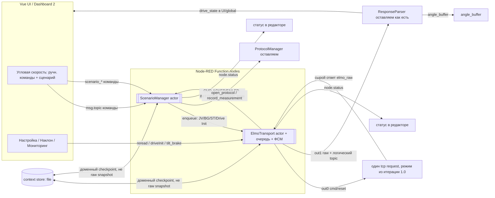

# Интеграция XState в Node-RED для управления ПЛК ELMO

Статус: проект (анализ перед реализацией). Код `flows.json` по этому документу пока не менялся.
Актуально на: 2026-05-26.
Охват: полный — **Этап 1 (ElmoTransport)** + **Этап 2 (ScenarioManager)**.

Источники: `docs/elmo-transport-design.md`, `docs/scenario-feature-summary.md`,
`docs/protocols-and-integrations.md`, `docs/project-state.md`, deep-research отчёт по
XState↔Node-RED, рекомендации к разработке ПО ELMO (Platinum Command Reference),
Приложение А к ТЗ, фактический код `flows.json`.

---

## 0. TL;DR

ELMO-контур в `flows.json` — это уже неявная конечная машина, «размазанная» по
`CommandHandler` / `ResponseParser` / двум `polling ELMO` / `Tilt` / `function 3` и
пяти независимым `tcp request`, что и порождает TCP race. Предлагается ввести **два явных
XState-актора v5**:

1. **`ElmoTransport`** — единственный сериализованный владелец TCP-обмена: очередь, один
   in-flight запрос, динамический опрос 1–30 Гц, `Drive Init` как наблюдаемая
   под-последовательность, обработка таймаутов/ошибок `SR`, и встроенный `CommandGate`.
2. **`ScenarioManager`** — сценарный рантайм поверх транспорта: последовательность
   шагов «скорость + удержание», критерий «Готов», авто-протоколирование, автосмена
   диапазона с `Drive Init`, пауза/стоп/авария с восстановлением через history.

Node-RED остаётся **I/O-оболочкой**: один `tcp request` (режим `char` или `sit` выбирается
acceptance-замером в итерации 1.0), существующие
`ResponseParser` и `ProtocolManager` переиспользуются как есть. Актор — «мозг», Node-RED —
маршрутизация, UI и файлы. Это прямое применение модели из deep-research отчёта
(«XState как semantically disciplined runtime, Node-RED как integration shell»).

---

## 0.1. Решения разработчика (Q&A 2026-05-26)

Ответы на уточняющие вопросы (`Вопросы по разработке с ответами.md`) фиксируют ряд
ранее открытых параметров. Эти решения встроены в разделы ниже; здесь — сводка.

| Тема | Решение | Где применено |
|---|---|---|
| **Частота опроса протокола** | **30 Гц максимум** (= 30 точек/оборот на макс. скорости); не больше, но и не меньше | §4.4 |
| **Источник времени для data-файла** | Простой запрос **время-угол** (`TM;PX`), без бракетинга `TM;PX;TM` и усреднения | §4.4.4 |
| **Параметры ELMO в data-файле** | **Никакие** — только `Время` и `Угол` (формат Приложения А) | §4.4.4 |
| **Критерий «скорость достигнута»** | **Время устойчивости** (stable_time); длительность подобрать по поведению ELMO (переходные процессы не сильно колебательные) | §5.3 |
| **Допуск точности** | Задаётся в **настройках ПО** (не в файле сценария), общий для ручного и сценарного режимов; отсчёт удержания — после стабилизации | §5.3 |
| **Timeout выхода на скорость** | **~10 с** → ошибка/пауза шага (выход быстрый) | §5.3 |
| **Гистерезис диапазонов** | Граница high/low = **20°/с**, гистерезис **±5°/с**; головки high физически работают до **48°/с** (8 об/мин). При небольшом пересечении границы диапазон сохраняется | §5.4 |
| **Период угла наклона (БУН)** | 1 с достаточно, настройка не нужна | вне этого контура |
| **Период БЕП** | Настраивается вне Node-RED (CAN-конвертер), задаётся один раз | вне этого контура |
| **Давление / безопасность** | Реле давления → один из входов **STO** ELMO (виден в `SR`, бит 7 «Safety»); датчик давления → **первый аналоговый вход ELMO** (`AN`), линейная зависимость напряжение↔давление | §5.9 (регион безопасности) |
| **БЕП пересчёт** | Линейная зависимость пФ↔мкм; коэффициенты уточняются | вне этого контура |

---

## 0.2. Доработки по ревью плана (2026-05-26)

**Раунд 1:**

| # | Замечание | Что изменено |
|---|---|---|
| **P0** | Слепой restore raw-snapshot транспорта опасен (actions при restore не переисполняются → зависание в `awaiting` с `inFlight`) | §4.6, §6.1: транспорт стартует всегда в `offline`, `inFlight=null`; долговечен только **доменный checkpoint** `{resolution}`, не `getPersistedSnapshot()`; состояние привода пересобирается первым poll |
| **P1** | poll не читал `OL[1]` (диапазон) | §4.4.4: extended-poll = `TM;PX;VX;MS;MO;SO;SR;AF;OL[1];OL[2];` + `AN` (добавлены `OL[1]`, `AF`) |
| **P1** | голодание state-poll за data-poll на 30 Гц | §4.4.4: вместо двух poll — **один poll с extended-payload раз в ~1000 мс**; гонки/aging нет, критичные поля (`SR/SO/MO/OL[1]/AN`) гарантированно ≥1 Гц |
| **P1** | Нет ACK-контракта транспорт↔сценарий | §4.5: добавлены `CMD.ACKED/FAILED/REJECTED(id)`; §5.1: шаг ждёт `CMD.ACKED`, а не enqueue (новое состояние `sending_speed`) |
| **P1** | «Машины в отдельных `.js`» vs запрет `require` в Function | §8.1: код машины — локальный npm-пакет `nc3-elmo-machines`, подключаемый как external module (фабрика, не `require` в теле) |
| **P2** | char vs sit на 30 Гц как поздний fallback | §4.4.3, §10: обязательный acceptance-замер `char` vs `sit` в **итерации 1.0** до постройки машины |

**Раунд 2:**

| # | Замечание | Что изменено |
|---|---|---|
| **P1** | ACK-loopback не сходится с текущим `ResponseParser`; ACK-only ответы (`;`,`BG`,`:?`) теряются | §4.6: сырой ответ `tcp request` возвращается **во вход транспорта** (`elmo_raw`), актор всегда освобождает `inFlight` и сам пересылает ответ в `ResponseParser` (независимо от UI-парсера) |
| **P1** | `topic:'elmo_tx'` ломает `angle_buffer` (ждёт `poll_data`) | §4.6: актор восстанавливает логический `topic` (`poll`→`poll_data`) на out1; `elmo_tx` — только строка в `tcp request` |
| **P1** | Statechart не доведён до исполнимой топологии | §4.3.1: добавлен минимальный исполнимый skeleton с точными таргетами (`#transport.…`) + smoke-тесты `offline→connecting→connected.idle`, timeout, recover |
| **P1/P2** | `ELMO.TIMEOUT` не закрывает зависший `tcp request` в `char` | §4.4.3, §10: в замер 1.0 включён сценарий «неверный/отсутствующий терминатор»; выбор recovery (`msg.reset` в `sit` / socket-timeout) |
| **P2** | `out:"char"` захардкожен | §3, §4.4.2, §4.6, §4.8: режим параметризован (`elmo_tcp_mode`, «режим из итерации 1.0») |
| **P2** | `rate_hz` без конвертации единиц | §4.4: `omega_deg_s = |VX|/CA[18]*360`, fallback на уставку до первого poll (`omegaSource`) |
| **P2** | `CMD.ACKED` и `INIT.DONE` смешаны | §4.5, §5.1: init-последовательность отдаёт наружу `INIT.DONE(id)/INIT.FAILED(id)`; ACK отдельных команд — внутри транспорта |
| **P2** | Нет deployment-детали для модулей | §9.1: где ставятся `xstate` и `nc3-elmo-machines` (userDir `npm install`, Setup-вкладка узла), как воспроизводится на целевой машине |

**Раунд 3:**

| # | Замечание | Что изменено |
|---|---|---|
| **P1** | `out:"char"` с `splitc=';'` может вернуть только первый фрагмент multi-token ответа (`TM;PX;VX;...`) | §4.4.2, §10, §11: проверять не просто терминатор, а **уникальный end-of-frame**, не встречающийся внутри ответа; `;` запрещён как `splitc` для multi-token poll |
| **P1** | Ветка `sit` не отражена в контракте узла | §4.4.3, §4.6: добавлен `FrameSplitter`/буфер для `sit` и эффект `resetTcp()`; raw в actor приходит только после сборки полного кадра |
| **P1** | Skeleton XState перехватывал `ENQUEUE` в child-state без enqueue-action и не отправлял первый запрос | §4.3.1: skeleton обновлён: `ENQUEUE` кладёт в очередь на конкретных переходах; `connecting` делает probe и ведёт в `connected.idle`, где dispatch запускает первый in-flight |
| **P1** | Deployment-раздел неверно отождествлял project dir и Node-RED `userDir` | §9.1: разделён `userDir` (`~/.node-red`, где `settings.js`/`node_modules`) и project dir (`~/.node-red/projects/LowSpeedCentrifuge3`) |
| **P2** | Скетч писал file-checkpoint на каждый snapshot | §4.6, §6.2: запись `{resolution}` только при фактической смене resolution |
| **P2** | Transport-generated poll не фиксировал финальный `CR` | §4.2, §4.6: invariant `sendTcp` нормализует финальный `\r` для всех команд, включая poll |

**Раунд 4 (реализация):**

| # | Замечание | Что изменено |
|---|---|---|
| **P0** | `global.nc3` не настроен → Function-узлы не инициализируются | §9.1: переход с `libs`/external modules на **`functionGlobalContext`** (require по пути, try/catch); flows.json без `libs`; bootstrap в settings.js один раз на машину; `scripts/setup-nc3.js` |
| **P0/P1** | Используется `file` context store, который не включён | Убран `file`-store: `context.get/set('elmo_checkpoint')` теперь в memory-store; `contextStorage` в settings.js не требуется. Чекпойнт — лишь pre-poll подсказка |
| **P1** | Динамический poll не работает — `context.vx`/`resolution` не обновляются | `src/parse.js` (`parseElmoScalars`) + action `ingestResp`: на `ELMO.RESP` извлекаются `VX`/`OL[1]`/`SO`/`MS`/`SR`, обновляют контекст → `computePollDelayMs` даёт реальные 1–30 Гц; setpoint-hint через `envelope.meta.setpointDegS` |
| **P1** | `resetTcp()` не чистит FrameSplitter | Транспорт получил **out3** → FrameSplitter; `resetTcp` шлёт `{reset:true}` и в tcp (out0), и в splitter (out3); splitter по `msg.reset` вызывает `splitter.reset()` |

---

## 1. Текущее состояние (подтверждено по коду)

| Факт | Где | Следствие |
|---|---|---|
| **5 независимых `tcp request`** на `192.168.1.2:2000` | `polling ELMO`(INIT), `polling ELMO`(BUN), `CommandHandler`(BUN), `Tilt`, `function 3` | TCP race: два запроса могут перекрыть запрос/ответ |
| Все в режиме `out:"time"` (`splitc` 100/1000 мс) | все 5 узлов | poll ≤10 Гц, +100 мс латентности на команду, **30 Гц недостижимы** |
| `CommandHandler` — **stateless** билдер строки команд | UI topic → `msg.payload = cmd + "\r"` | переиспользуем как генератор команд, не как владелец сокета |
| `ResponseParser` — **stateless** парсер | оба формата `PARAM=VALUE`/`PARAM;VALUE`, декод `SR`, `OL[1]`, `OL[2]`, `tm_us` | переиспользуем как есть, не переписываем |
| `driveInit` — **25+ команд одной строкой** через `;\r` | `CommandHandler` case `driveInit` | НЕ ждёт `SO=1`, НЕ ждёт завершения оборота `MS==0` → хрупко |
| `functionExternalModules: true` | `~/.node-red/settings.js:500` | XState v5 можно подключить как external module в Function node |
| `contextStorage` **закомментирован** | `settings.js:340` | сейчас только in-memory; для persist снапшота нужно включить file-store |
| Поведение разнесено по `switch`/`change`/`function` | весь ELMO-контур | нет единой точки истины состояния, нет stale-detection, нет CommandGate |

### Текущая проводка ELMO (фактическая)

```
polling ELMO (INIT) ─► tcp#1 ─► ResponseParser(INIT) ─► global.obj
polling ELMO (BUN)  ─► tcp#2 ─► (link) ─► ResponseParser(BUN) ─┐
Tilt                ─► tcp#3 ─► (link) ─► ResponseParser(BUN) ─┤─► switch ─► to UI / SET GLOBAL STATE
function 3 (PX)     ─► tcp#4 ─► debug                          │
CommandHandler      ─► tcp#5 ─► ResponseParser(BUN) ───────────┘─► angle_buffer
```

Пять продьюсеров держат пять сокетов. Это и есть гонка из `docs/elmo-transport-design.md` §1.0.

---

## 2. Почему XState именно здесь

Согласно deep-research отчёту, XState оправдан там, где есть: вложенные режимы,
параллельные подсистемы, пауза/возобновление/history, долгоживущие асинхронные операции,
аудируемый жизненный цикл и высокая цена ошибки в ветвлении состояний. ELMO-контур НЦ-3
обладает **всеми** этими свойствами:

- **Иерархия (Harel hierarchy / XState compound):** `connected → {idle, ready, sending, awaiting}`, `init` как вложенная под-последовательность.
- **Длительные активности (Harel activity / XState `invoke`+`after`):** ожидание `SO=1` (по рекомендациям — «мгновенно или десятки секунд»), один оборот при `Drive Init` (`MS==0`), удержание шага сценария, TCP round-trip.
- **Broadcast внутри машины (Harel broadcast / XState `raise`+`parallel`):** `EMERGENCY_STOP` одновременно гасит исполнитель шага и взводит безопасность — ровно пример из отчёта (`raise({type:'EMERGENCY_STOP'})` в parallel-состоянии).
- **History (Harel `H*` / XState `history:'deep'`):** возврат сценария в прерванную вложенную конфигурацию после паузы/аварии.
- **Guards:** валидация диапазона, критерий «Готов», `canRetry`, единый in-flight gate, интерлок `set_resolution` при `SO=1`.

Параллельно XState закрывает четыре P0-пункта роадмапа (`docs/project-state.md` §10):
устранение TCP race, stale-detection (через `updated_at`/`quality` в контексте актора),
единый `CommandGate` (актор отвергает команды по состоянию) и базу для `ScenarioManager`.

### Соответствие Harel → XState → НЦ-3

| Концепт Harel | XState v5 | Применение в НЦ-3 |
|---|---|---|
| Compound state (XOR) | parent/child `states`, `initial` | связь `offline/idle/ready`, под-последовательность `init` |
| Orthogonality (AND) | `type:'parallel'` | `ElmoTransport`: регион «линия связи» ∥ регион «состояние привода»; `Scenario`: «исполнитель» ∥ «монитор безопасности» |
| Broadcast | `raise(...)` + parallel | `EMERGENCY_STOP`, `ELMO.FAULT` гасят несколько регионов сразу |
| History `H*` | `type:'history', history:'deep'` | `RESUME` сценария в прерванный шаг |
| Default entry | `initial` | стартовый режим транспорта/сценария |
| Activity (start/stop/active) | `invoke` + `after` | ожидание `SO=1`, оборот `Drive Init`, удержание шага, TCP round-trip |
| Action (zero-time) | `actions`, `entry`, `exit`, `assign`, `raise` | `node.status`, обновление `drive_state`, постановка в очередь |
| Guard | `guard` | диапазон, «Готов», интерлоки, single-in-flight |
| Микрошаги | `always` (eventless) + Inspection `@xstate.microstep` | переходы очереди без видимого snapshot — наблюдать через inspection |

---

## 3. Целевая архитектура



Принципы (из deep-research отчёта):

- **Один локализованный stateful-актор на область ответственности.** Не разносить переходы по узлам.
- **Граница машины = bounded context.** `ElmoTransport` = весь TCP-обмен; `ScenarioManager` = сценарный жизненный цикл. Не смешивать с общей ETL-логикой flow.
- **Контракт «снаружи»:** входящие `msg` → `event`, наружу — снапшоты + domain-события + `node.status`.
- **Переиспользуем проверенное:** `ResponseParser`, `ProtocolManager`, `angle_buffer`, таблица `RES` из `CommandHandler` — без переписывания (README rule 3).

### Два актора, два Function-узла — почему не один parent-machine

Решение: **два отдельных Function-узла**, общающихся через Node-RED `link` по
явному событийному контракту (а не один parent с `spawn`+`sendTo`).

- Плюсы: пошаговая миграция (Этап 1 деплоится и проверяется без Этапа 2); независимое
  тестирование; меньший «blast radius»; транспорт продолжает обслуживать ручной UI, даже
  если сценарный актор остановлен.
- Минус: межакторная связь не через `sendTo`, а через `link`/`msg`. По отчёту это
  нормально: вне одной машины XState и так предполагает явную адресную коммуникацию.
- Альтернатива (parent + child actors с внутренним `sendTo`/broadcast) задокументирована
  как возможная консолидация после стабилизации обоих акторов — но не на старте.

---

## 4. ElmoTransport (Этап 1)

### 4.1. Роль и инварианты

- **Единственный** владелец TCP. Все продьюсеры (UI-команды, poll, Tilt, init,
  сценарий) только формируют «конверт» и кладут его в очередь актора.
- **Один in-flight:** следующий запрос — только после `ELMO.RESP` или `ELMO.TIMEOUT`.
- **Завершение чтения по терминатору** (режим `char` или `sit`, не `time`), а не по
  таймеру — обязательное условие для 30 Гц; конкретный режим выбирается в итерации 1.0
  (§4.4.3, см. §11 — открытый вопрос про точный терминатор).
- **CommandGate:** опасные команды отвергаются по состоянию (например, `set_resolution`
  только при `SO==0`; ручные команды движения блокируются, пока активен сценарий).

### 4.2. Конверт запроса (контракт очереди)

```js
{
  id,                       // корреляция
  kind: 'cmd'|'tilt'|'init'|'poll',
  priority,                 // cmd(3) > tilt(2) > poll(1)
  cmd: "TM;PX;VX;",         // строка ELMO без финального CR (lean/extended — §4.4.4); сборка через билдер
  expect: 'parse'|'ack',
  meta: { topic, origin }   // для журнала и маршрутизации ответа
}
```

Правила: дедуп poll (в очереди не более одного poll-конверта; payload — lean или extended,
§4.4.4), приоритетная вставка, для poll нет retry (просто следующий tick), для cmd
опционально 1 retry.

**Инвариант TCP-фрейминга:** все команды, включая poll, уходят в `tcp request` с финальным
`CR` (`\r`). Конверт хранит логическую команду без обязательного `CR`, а эффект `sendTcp`
нормализует payload: если строка не заканчивается `\r`, он добавляет `\r`. Это сохраняет
совместимость с текущим `CommandHandler`, который уже делает `msg.payload = elmoCmd + "\r"`,
и не даёт transport-generated poll уйти как незавершённая команда.

### 4.3. Состояния ФСМ

```mermaid
stateDiagram-v2
    [*] --> offline
    offline --> connecting: TCP up / first enqueue
    connecting --> idle: ELMO.RESP ok
    connecting --> offline: ELMO.TIMEOUT xN

    state connected {
        [*] --> idle
        idle --> ready: motor_on -> powering_on -> SO==1
        ready --> idle: motor_off / MO==0

        state powering_on {
          [*] --> wait_so
          wait_so --> done_on: SO==1
          wait_so --> fault: timeout / EE[5]!=0
        }

        idle --> sending: dequeue
        ready --> sending: dequeue
        sending --> awaiting: TCP.SEND
        awaiting --> dispatch: ELMO.RESP
        awaiting --> fault: ELMO.TIMEOUT / SR error
        dispatch --> idle: schedule next (after rate_hz)
        dispatch --> ready: schedule next (after rate_hz)

        state init {
          [*] --> i_stop
          i_stop --> i_motor_off : ST; MO=0
          i_motor_off --> i_set_range : OL[1],CA[18],S1[5],KP[2],SD,QS,VH,VL,ER,TR
          i_set_range --> i_clear : AF=0; EC=0
          i_clear --> i_motor_on : MO=1
          i_motor_on --> i_wait_so : wait SO==1
          i_wait_so --> i_one_turn : SP;AC;DC; PR=CA[18]; BG
          i_one_turn --> i_verify : wait MS==0
          i_verify --> [*] : INIT.DONE
          i_wait_so --> fault : timeout
          i_one_turn --> fault : timeout / SR error
        }
        idle --> init: INIT.START
        ready --> init: INIT.START
        init --> idle: INIT.DONE
    }
    connected --> offline: ELMO.TIMEOUT xN / tcp error
    fault --> idle: fault cleared (EC=0, SR bits 0-3 == 0)
    fault --> offline: comms lost
```



Ключевое улучшение против текущего кода: `init` и `powering_on` — **наблюдаемые
последовательности с ожиданием** `SO==1` и `MS==0`, а не «выстрелить 25 команд одной
строкой». Это прямо реализует алгоритмы из рекомендаций ELMO (§3 запуск привода, §4
переключение головок, Приложение А «один оборот для сумматора DSi»).

#### 4.3.1. P1: минимальный исполнимый skeleton (точные XState-таргеты)

Диаграмма выше — концептуальная; в коде вложенность требует точных таргетов
(`'connected.idle'`, `'#transport.connected.idle'`). Перед полной машиной собрать и
протестировать минимальный skeleton (XState v5), покрывающий `offline → connecting →
connected.idle`, первый queued-запрос после подключения, таймаут и recover.

**Важный нюанс XState:** переходы ищутся от самого вложенного активного состояния вверх.
Поэтому нельзя полагаться на root-level `on.ENQUEUE`, если `offline.on.ENQUEUE` тоже
перехватывает событие: enqueue-action должен стоять на конкретном переходе, который
принимает `ENQUEUE`, иначе первый запрос может перевести машину в `connecting`, но не
попасть в очередь.

```js
import { setup, assign } from 'xstate';

export const transportSkeleton = setup({
  guards: { hasWork: ({ context }) => context.queue.length > 0 },
  delays: { TIMEOUT: 180 },
  actions: {
    enqueue: assign({
      queue: ({ context, event }) => context.queue.concat(event.envelope)
    }),
    emitProbe: () => {},        // короткий read/probe для проверки TCP/ELMO
    sendNext: assign({
      inFlight: ({ context }) => context.queue[0] || null,
      queue: ({ context }) => context.queue.slice(1)
    }),
    emitSend: ({ context }) => {
      if (context.inFlight) {
        // эффект Node-RED: sendTcp(context.inFlight.cmd) с нормализацией CR (§4.2)
      }
    },
    freeInFlight: assign({ inFlight: null })
  }
}).createMachine({
  id: 'transport',
  context: { queue: [], inFlight: null },
  initial: 'offline',
  states: {
    offline: {
      on: {
        ENQUEUE: { actions: 'enqueue', target: 'connecting' },
        TCP_UP: 'connecting'
      }
    },
    connecting: {
      entry: 'emitProbe',
      on: {
        ENQUEUE: { actions: 'enqueue' },
        'ELMO.RESP': 'connected.idle',
        'ELMO.TIMEOUT': 'offline'
      }
    },
    connected: {
      initial: 'idle',
      on: { ENQUEUE: { actions: 'enqueue' } },
      states: {
        idle:     { always: { guard: 'hasWork', target: 'sending' } },
        sending:  { entry: ['sendNext', 'emitSend'], always: 'awaiting' },
        awaiting: {
          after: { TIMEOUT: { target: '#transport.fault' } },     // абсолютный target по id
          on: { 'ELMO.RESP': 'dispatch', 'ELMO.TIMEOUT': '#transport.fault' }
        },
        dispatch: { entry: 'freeInFlight', always: 'idle' }
      }
    },
    fault: {
      on: {
        ENQUEUE: { actions: 'enqueue' },
        CLEARED: 'connected.idle',
        LOST: 'offline'
      }
    }   // recover
  }
});
```

Smoke-тесты (pure, вне Node-RED): `offline --ENQUEUE--> connecting --ELMO.RESP-->
connected.idle -> sending -> awaiting`; первый envelope реально попал в `inFlight`;
`awaiting --(TIMEOUT)--> fault --CLEARED--> connected.idle`; один in-flight
(второй ENQUEUE не отправляется до dispatch). Полные `powering_on`/`init`/poll добавляются
поверх этого скелета только после прохождения smoke-тестов.

### 4.4. Опрос ПЛК на 30 Гц (детально, со ссылками на документацию Node-RED)

Цель (Q&A): держать **до 30 Гц** — 30 точек/оборот на максимальной скорости, не реже 1 Гц
в покое. Формула из `elmo-transport-design.md` §1.4:
`rate_hz = clamp(|ω°/с| / 12, 1, 30)` (30·(ω/360)=ω/12; при 360°/с → 30 Гц, при ≤12°/с → 1 Гц).

**P2: ω должна быть в °/с, а `VX` приходит в метках/с.** Формула оперирует градусами, поэтому
нужна явная конвертация по текущему разрешению:

```
ticks_per_rev = (resolution === 'high') ? 262144000 : 6553600   // CA[18]
omega_deg_s   = Math.abs(VX) / ticks_per_rev * 360
rate_hz       = clamp(omega_deg_s / 12, 1, 30)
```

**Fallback на уставку сразу после команды скорости.** Между отправкой `JV+BG` и первым poll,
показавшим новую `VX`, `VX` ещё старая → частота вычислится неверно. Поэтому сразу после
`set_velocity`/сценарного шага брать ω **из уставки** (целевая скорость в °/с), а на `VX`
переключаться, как только poll подтвердит фактическую скорость. Источник ω держать в
контексте (`omegaSource: 'setpoint' | 'measured'`).

#### 4.4.1. Почему текущий режим не даёт 30 Гц

Все 5 `tcp request` сейчас в режиме `out:"time"` со `splitc` 100/1000 мс. Официальная
справка ядра Node-RED для узла `tcp request` описывает режимы возврата так (дословно):

> *«It can either count a number of returned characters into a fixed buffer, match a
> specified character before returning, wait a fixed timeout from first reply and then
> return, sit and wait for data, or send then close the connection immediately, without
> waiting for a reply.»*

Это пять режимов поля `out`: `count` / `char` / `time` / `sit` / `immed`. В режиме
`time` узел **ждёт фиксированный таймаут от первого ответа и только потом возвращает** —
т.е. при `splitc=100` каждый цикл искусственно длится ≥100 мс → потолок ~10 Гц и +100 мс
латентности на каждую команду. **30 Гц в `out:"time"` принципиально недостижимы.**

#### 4.4.2. Стартовый кандидат: `out:"char"` (по терминатору ответа)

Стартовый кандидат — `out:"char"`: узел «match a specified character before returning»,
т.е. возвращает ответ сразу по приходу символа-терминатора ELMO Direct Access, без таймера.
Это убирает 100-мс ожидание: длительность цикла = реальное время round-trip, а не
фиксированное окно. **Финальный режим (`char` vs `sit`) выбирается замером в итерации 1.0**
(§4.4.3, §10) — поэтому в коде режим параметризован (`mode`, §4.6), а не захардкожен.

`splitc` = символ конца **полного кадра ответа** ELMO. **Критично:** `;` нельзя принимать
как `splitc` для multi-token poll (`TM;PX;VX;...`) без отдельного подтверждения, потому
что `tcp request` в режиме `char` вернёт сообщение на первом совпадении символа и может
разрезать ответ после первого токена. В acceptance 1.0 проверяется не просто «какой символ
есть в ответе», а есть ли **уникальный end-of-frame**, не встречающийся внутри ответа
(`CR`, `LF`, `CRLF` или иной). Если уникального end-of-frame нет, `char` не используется
для multi-token poll; выбирать `sit` с собственным кадровым буфером (§4.4.3, §11.1).

#### 4.4.3. Бюджет времени на 30 Гц и риск переподключения

30 Гц ⇒ **33,3 мс** на полный цикл «отправить → дождаться ответа → распарсить →
запланировать следующий». При одном in-flight это последовательная цепочка, поэтому
каждый round-trip обязан укладываться в этот бюджет. На LAN до `192.168.1.2` сетевой RTT
обычно <1–2 мс; критичны время обработки команды самим ELMO и накладные расходы Node-RED.

**Важный нюанс режима `char`:** в режимах `char`/`count`/`time` узел `tcp request`
открывает соединение на запрос и закрывает после ответа (постоянным остаётся только
режим `sit` — «sit and wait», remain connected). Значит `char` на 30 Гц делает ~30
TCP-рукопожатий в секунду. На LAN это, как правило, допустимо, но если измерения покажут,
что connect/teardown — узкое место у границы 30 Гц, есть штатная альтернатива:

- **Резервный режим `out:"sit"` (постоянное соединение).** Одно TCP-соединение держится
  открытым; команды отправляются в открытый сокет, ответы стримятся обратно, а кадрирование
  по терминатору/грамматике ответа делаем на нашей стороне: **FrameSplitter** между
  `tcp request` и `ElmoTransport` накапливает байты и выпускает `ELMO.RESP` только после
  сборки полного кадра. Корреляция тривиальна, т.к. XState гарантирует один in-flight.
  По документации в режиме «sit and wait» можно слать `msg.reset = true` или
  `msg.reset = "host:port"`, чтобы принудительно разорвать соединение и автоматически
  переподключиться — это и есть механизм перехода `connected → offline → connecting`
  в ФСМ при таймауте/ошибке связи.

  Для `sit` контракт effect-слоя шире, чем простой `sendTcp(cmd)`: нужен `resetTcp()`
  (или out0-сообщение с `msg.reset`) и очистка буфера FrameSplitter на каждом timeout/reset.
  Сырой поток из `tcp request` **не** должен идти напрямую в actor; actor получает только
  собранный полный кадр, помеченный `msg.elmo_raw=true`.

**P1/P2: внутренний `ELMO.TIMEOUT` не закрывает зависший `tcp request` в `char`-режиме.**
Если ответ не придёт с ожидаемым терминатором (неверный/отсутствующий символ конца,
частичный ответ), актор по своему watchdog (`after TIMEOUT`) освободит `inFlight` и пойдёт
дальше — **но сам узел `tcp request` в `char`-режиме продолжит ждать терминатор/свой
socket-timeout**, и его «поздний» ответ придёт уже не к тому конверту. У актора нет прямого
способа отменить ожидание `char`. Поэтому нужен явный механизм закрытия/сброса соединения:

- в `out:"sit"` — `msg.reset` (документировано) закрывает и переподключает сокет → актор
  по `ELMO.TIMEOUT` шлёт `reset` и сбрасывает кадровый буфер; «поздние» байты отбрасываются;
- в `out:"char"` — нет `msg.reset`; полагаемся на socket-timeout Node-RED и на дедуп по
  корреляции (ответ без активного `inFlight` игнорируется), либо выбираем `sit` именно
  ради управляемого сброса.

**Решение `char` vs `sit` — обязательный acceptance-замер в итерации 1.0** (§10), а не
поздний fallback. На стенде измерить для обоих режимов: реальный RTT, джиттер, достижимый
потолок частоты, корректность кадрирования multi-token ответа, поведение при обрыве связи
и **сценарий «неверный/отсутствующий терминатор»** — и выбрать режим, который и держит ≥30 Гц, и даёт **управляемое
восстановление** из зависшего запроса. ФСМ и контракт событий от выбора **не зависят**
(меняется только узел I/O и наличие шага кадрирования/сброса), поэтому замер можно сделать
до постройки всей машины.

#### 4.4.4. Единый poll с периодически расширяемым payload

Q&A зафиксировал: в data-файл пишутся **только время и угол**, источник времени — простой
запрос время-угол без усреднения. При этом во время вращения параметры привода мы не
меняем — единственное, что нужно ловить периодически, это **ошибку/статус от ПЛК**.
Поэтому вместо двух конкурирующих видов poll используется **один вид poll** с одной
частотой, у которого payload **периодически расширяется** критичными полями. Это
полностью снимает проблему голодания (нет приоритетной гонки двух poll) и упрощает очередь.

- **Обычный (lean) poll — основная масса, до 30 Гц:** `TM;PX;VX;`
  `TM`+`PX` — точка `{t, angle}` для буфера; `VX` — для критерия «Готов» и live-скорости в UI.
  Минимальная строка ⇒ меньше байт на round-trip ⇒ запас по бюджету 33,3 мс.
- **Расширенный (extended) poll — ровно один раз в ~1000 мс:** к lean-строке добавляются
  критичные поля: `TM;PX;VX;MS;MO;SO;SR;AF;OL[1];OL[2];` (+ `AN` давления, §5.9) —
  здоровье привода, статусы, ошибки, режим `AF`, **текущий диапазон `OL[1]`**, тормоз
  `OL[2]`, давление. `OL[1]` обязателен: по нему определяется диапазон (project-state §2)
  и работает автосмена сценария (§5.4); `AF` — remote-control/abort из контракта
  (protocols-and-integrations §команды).

**Логика выбора payload** (внутри планировщика, без второй очереди): храним
`lastExtendedAt`. Планируя очередной poll, если `now − lastExtendedAt ≥ state_period_ms`
(по умолчанию 1000 мс) — собираем extended-строку и обновляем `lastExtendedAt`; иначе
lean. Таким образом критичные поля гарантированно обновляются ≥1 Гц **независимо** от
текущей частоты вращения, и при этом нет ни приоритетов между poll, ни aging, ни риска
вытеснения. Приоритет в очереди прежний: `cmd > tilt > poll`; дедуп — не более одного
poll в очереди.

> Накладные расходы extended-poll пренебрежимы: на 30 Гц это 1 «тяжёлый» запрос из 30, на
> 1 Гц — каждый запрос и так extended. Лишних round-trip нет — extended заменяет один из
> обычных poll, а не добавляется к нему.

> Это упрощает текущий `MS;TM;PX;TM;MO;SO;VX;OL[2];`: двойной `TM` и усреднение
> `tm_us=(before+after)/2` в `ResponseParser`/`angle_buffer` больше не нужны (санкционировано
> ответом Q&A). Изменение точечное: один `TM`, поле `tm_us` берётся напрямую.

#### 4.4.5. Самотактирование через XState и таймеры Node-RED

Опрос **самотактируется**, без отдельного `inject` на 30 Гц: после диспетчеризации ответа
состояние `dispatch` ставит задержанный переход `after` на `1000/rate_hz` мс (задержка
вычисляется из текущего `VX`), по срабатыванию поднимается внутренний `POLL.TICK` →
poll-конверт в очередь (payload lean или extended по правилу §4.4.4). Следующий poll
планируется **только после** завершения предыдущего ⇒ один in-flight соблюдается
автоматически, а период адаптируется к скорости.

XState реализует `after` через `setTimeout`. Официальная документация Node-RED по функциям
([Writing Functions](https://nodered.org/docs/user-guide/writing-functions)) разрешает
использовать `setTimeout`/`setInterval` в Function-узле и **требует очищать незавершённые
таймеры в обработчике `On Stop` («Close»)**, иначе при redeploy они утекут. У нас это
покрыто: `On Stop` вызывает `actor.stop()`, который отменяет все запланированные `after`.
Сам актор живёт в node-context между сообщениями — это штатный паттерн хранения состояния
Function-узла (там же, раздел про сохранение данных между сообщениями).

> Замечание по буферизации: при высокой частоте следить за `nodeMessageBufferMaxLength`
> (Node-RED settings) — но поскольку один in-flight и нет веерного клонирования сообщений в
> горячем пути, очередь сообщений Node-RED не растёт.

### 4.5. Контракт событий

```
Входы (actor.send):
  UI.CMD        { envelope }          — ручная/сценарная команда (из CommandHandler-билдера)
  POLL.TICK                            — внутренний (after), кладёт poll-конверт
  ELMO.RESP     { raw }               — полный frame ответа (elmo_raw), до UI-парсинга (§4.6)
  ELMO.TIMEOUT                         — внутренний watchdog (after ~150–200 мс)
  INIT.START    { resolution }
  TILT.SET      { ol2 }               — тормоз внешней оси OL[2]
  MOTOR.ON / MOTOR.OFF / DRIVE.STOP

Выходы (actions → node.send):
  out0 TCP.SEND/RESET { cmd|reset }   — строка/сброс в единственный tcp request (режим из итерации 1.0)
  out1 RESP.FWD     { topic, raw }    — сырой ответ с ВОССТАНОВЛЕННЫМ topic → ResponseParser (§4.6)
  out2 CMD.ACKED    { id, raw }       — одиночная команда id ФАКТИЧЕСКИ исполнена (пришёл ответ)
  out2 CMD.FAILED   { id, reason }    — таймаут/ошибка SR при исполнении команды id
  out2 CMD.REJECTED { id, reason }    — CommandGate отклонил команду до отправки (интерлок)
  out2 INIT.DONE / INIT.FAILED { id } — итог init-последовательности (не CMD.ACKED, §4.5)
  out2 transport_state                 — для ScenarioManager и журнала
  out2 ELMO.FAULT / ELMO.OFFLINE
  (drive_state в UI/global формирует ResponseParser ниже по out1 — путь не меняется)
```

**ACK-контракт (обязателен для сценария).** Конверт несёт `id` (§4.2). Различаем два уровня:

- **Одиночная команда** (`kind:'cmd'|'tilt'`): транспорт эмитит ровно одно из
  `CMD.ACKED(id)` / `CMD.FAILED(id)` / `CMD.REJECTED(id)`.
- **Init-последовательность** (`kind:'init'`, §4.3): это многошаговая под-последовательность
  (ST→MO=0→…→оборот→verify); наружу отдаём **только итог** `INIT.DONE(id)` / `INIT.FAILED(id)`,
  а внутренние ACK отдельных Elmo-команд остаются **внутри транспорта** и наружу не текут.

Продьюсер (особенно `ScenarioManager`) **переходит дальше только по `CMD.ACKED(id)`**
(для шага скорости) или **`INIT.DONE(id)`** (для смены диапазона), а не по факту постановки
в очередь — иначе шаг уйдёт в `waiting_ready`/продолжит сценарий до фактического исполнения
или после отклонения интерлоком. Для poll-конвертов ACK не эмитится (их результат —
обновление `drive_state`).

### 4.6. Контракт Function-узла «ElmoTransport»

#### P1: сырой ответ всегда уведомляет актор (не зависим от UI-парсера)

Критично: **актор должен узнавать о приходе ответа независимо от `ResponseParser`**.
Текущие парсеры (`flows.json` ~ResponseParser в INIT/BUN) не выставляют событие
`ELMO.RESP` и могут **отбросить ACK-only ответы** (`;`, `BG`, `:?` и т. п.), которым нечего
дать UI. Если бы актор ждал ответ от UI-парсера, он завис бы в `awaiting` на каждой
команде без «полезного» ответа. Поэтому топология такая:

```
[ElmoTransport]──out0 cmd/reset──►[tcp request]
          ▲                         │
          │                         ├─ char: raw full frame ───────────────┐
          │                         └─ sit: byte stream ─►[FrameSplitter]──┤
          └──── full frame (msg.elmo_raw=true) ◄────────────────────────────┘
          │ актор: free inFlight, корреляция
          ├─out1 (raw + ВОССТАНОВЛЕННЫЙ topic)─►[ResponseParser]→UI/angle_buffer
          └─out2 (CMD.ACKED/FAILED, события)─►[ScenarioManager]
```

- Ответ `tcp request` возвращается **во вход транспорта** (помечен `msg.elmo_raw=true`
  тонким change-узлом или свойством). Актор по нему **всегда** освобождает `inFlight`,
  коррелирует с текущим конвертом (один in-flight ⇒ ответ принадлежит ему) и решает
  `CMD.ACKED`/`CMD.FAILED` — даже для ACK-only строк.
- В режиме `char` вход транспорта получает уже полный frame от `tcp request`; это допустимо
  только если выбранный `splitc` — уникальный end-of-frame, не встречающийся внутри ответа.
- В режиме `sit` вход транспорта получает frame **только после FrameSplitter**. Сам поток
  байтов из `tcp request` не должен освобождать `inFlight`, иначе partial frame будет принят
  за ответ команды. На `ELMO.TIMEOUT` транспорт вызывает `resetTcp()` и очищает FrameSplitter.
- Затем актор **сам** пересылает сырой ответ на `out1` с **восстановленным логическим
  `topic`** конверта (`poll` → `poll_data`), и только дальше стоит `ResponseParser` для
  UI/`drive_state`/`angle_buffer`. ResponseParser остаётся as-is и может молча игнорировать
  ACK-only — это уже не влияет на ход очереди.

> Это же решает P1 по `topic`: `angle_buffer` принимает только `topic==='poll_data'`
> (`flows.json`), поэтому актор для poll-конвертов выставляет `topic:'poll_data'` на out1,
> а не `elmo_tx`. `elmo_tx` (out0) — это только строка в `tcp request`, для downstream неважна.

#### Код узла (скетч)

```js
// === Вкладка Setup/Modules: подключить external modules:
//     xstate (v5) → переменная xstateLib;  nc3-elmo-machines → переменная nc3 (§8.1) ===

// === On Start ===
const { createActor } = xstateLib;
const { createElmoTransport } = nc3;          // фабрика машины из локального npm-пакета (§8.1)

function ensureCr(cmd) {
  const text = String(cmd || '');
  return text.endsWith('\r') ? text : text + '\r';
}

// P0: транспорт НЕ восстанавливаем из raw-snapshot (§6.1). При redeploy XState не
// переисполняет actions/invoke, поэтому restore в awaiting/sending с inFlight «зависнет».
// Стартуем ВСЕГДА свежим в offline; состояние привода пересоберём первым poll.
const ckpt = context.get('elmo_checkpoint', 'file') || {};

// Машина определена в пакете; узел передаёт ей «эффекты» Node-RED через input:
const machine = createElmoTransport({
  sendTcp:   (cmd)            => node.send([{ topic: 'elmo_tx', payload: ensureCr(cmd) }, null, null]),
  resetTcp:  ()               => node.send([{ topic: 'elmo_reset', reset: true }, null, null]),
  // пересылка сырого ответа в ResponseParser с ВОССТАНОВЛЕННЫМ логическим topic:
  forwardResp: (raw, topic)   => node.send([null, { topic: topic || 'poll_data', payload: raw }, null]),
  emitEvent: (evt)            => node.send([null, null, evt]),   // CMD.ACKED/FAILED, transport_state…
  setStatus: (st)             => node.status(st),
  mode:      context.get('elmo_tcp_mode','file') || 'char',      // режим выбран в итерации 1.0 (§10)
});

const actor = createActor(machine, { input: { resolution: ckpt.resolution || 'high' } }).start();

let lastCheckpointResolution = ckpt.resolution || null;
actor.subscribe((snap) => {
  context.set('transport_state', snap.value);
  const resolution = snap.context.resolution;
  if (resolution && resolution !== lastCheckpointResolution) {
    context.set('elmo_checkpoint', { resolution }, 'file'); // доменный checkpoint, не 30 Гц
    lastCheckpointResolution = resolution;
  }
});

context.set('elmoActor', actor);   // actorRef живёт ТОЛЬКО в in-memory node-context

// === On Message ===
const actor = context.get('elmoActor');
if (!actor) { node.error('ElmoTransport actor не инициализирован', msg); return null; }

if (msg.elmo_raw === true) {                  // сырой ответ из tcp request
  actor.send({ type: 'ELMO.RESP', raw: msg.payload });
  return null;                                // пересылку в парсер делает action forwardResp
}
const envelope = buildEnvelope(msg.topic, msg.payload);   // билдер из CommandHandler (§4.7)
if (envelope) actor.send({ type: 'UI.CMD', envelope });
return null;                                  // весь вывод — через actions/subscribe (node.send)

// === On Stop ===
const actor = context.get('elmoActor');
if (actor) actor.stop();
```

Выходы узла: **out0** — строка/`reset` в `tcp request`; **out1** — сырой ответ с логическим
`topic` → `ResponseParser`; **out2** — `CMD.ACKED/FAILED/REJECTED`, `INIT.DONE/FAILED`,
`transport_state` → `ScenarioManager`/журнал.

Если в итерации 1.0 выбран `sit`, между `tcp request` и входом транспорта добавляется
тонкий `FrameSplitter` Function-узел: он буферизует поток, режет его по подтверждённому
end-of-frame/грамматике ответа и только затем ставит `msg.elmo_raw=true`. Если выбран
`char` с уникальным end-of-frame, отдельный `FrameSplitter` не нужен.

Важные ограничения Node-RED (README rules 7–8): код function-узла — **тело функции**,
без `import/require/export`; `xstate` и `nc3-elmo-machines` доступны только как настроенные
external modules (§8.1); сообщения до конца `On Start` Node-RED ставит в очередь — потерь нет.

### 4.7. Где живёт сборка команд

`CommandHandler` сегодня — единственный билдер строки ELMO. Чтобы не дублировать 21 КБ
логики и таблицу `RES`, на старте: оставить `CommandHandler` как есть, но его выход
направить НЕ в собственный `tcp request`, а в `ElmoTransport` (как `UI.CMD`). То есть
`CommandHandler` превращается из «продьюсера сокета» в «билдер конверта». Это
минимальная правка проводки, не кода.

### 4.8. Проводка после Этапа 1

```
CommandHandler ─┐
Tilt           ─┤
function 3     ─┼─► [ElmoTransport actor] ──out0 cmd/reset──► [один tcp request (режим из 1.0)]
poll(INIT)     ─┤        ▲   │                                             │
poll(BUN)      ─┘        │   └─out1 raw+topic─► [ResponseParser] ─► drive_state / angle_buffer / UI
                        └────── full frame (elmo_raw) ◄── [FrameSplitter только для sit] ◄── raw/stream
                            out2 ─► CMD.ACKED/FAILED, INIT.DONE/FAILED, transport_state ─► ScenarioManager
```

Ключевое отличие от прежней схемы: сырой ответ `tcp request` возвращается **в транспорт**
(а не сразу в парсер). В `char` это должен быть полный frame от `tcp request`; в `sit` —
полный frame после `FrameSplitter`. Только после этого актор освобождает `inFlight` и
пересылает ответ в `ResponseParser` (§4.6). Так ACK-only ответы не теряются, partial frames
не принимаются за ACK, а очередь не зависает.

### 4.9. Миграция Этапа 1 (по шагам, без поломок — из design-doc §1.6)

1. Ввести `ElmoTransport` + **один** `tcp request` (режим из итерации 1.0) параллельно старым; проверить poll.
2. Перевести regular poll (BUN) на транспорт; проверить `angle_buffer`/`drive_state`.
3. Перевести `CommandHandler` (enqueue вместо своего `tcp request`); удалить его сокет.
4. Перевести `Tilt` и `function 3`.
5. Перевести INIT polling.
6. Удалить старые 5 `tcp request`, оставить один.
7. Включить динамический период 1–30 Гц.

На каждом шаге — deploy + проверка. Acceptance: poll стабилен, `Drive Init` даёт
понятный success/error/timeout, `set_resolution` невозможен при движении/включённом приводе.

---

## 5. ScenarioManager (Этап 2)

Строится **поверх** `ElmoTransport`: сценарий не создаёт своих TCP-сессий, все команды
движения идут конвертами в транспорт; плотность data-файла обеспечивает динамический
опрос Этапа 1.

### 5.1. Состояния ФСМ (из scenario-feature-summary.md §Состояния)

```mermaid
stateDiagram-v2
    [*] --> idle
    idle --> loading_file: scenario_load
    loading_file --> ready: parsed OK + протокол открыт
    loading_file --> error: parse/range error

    ready --> active: scenario_start

    state active {
        [*] --> running_step
        running_step --> range_switch_pending: target вне диапазона (с гистерезисом §5.4)
        running_step --> sending_speed: enqueue AC;DC;JV;BG (id)
        sending_speed --> waiting_ready: CMD.ACKED(id)
        sending_speed --> error: CMD.FAILED/REJECTED(id)
        waiting_ready --> holding: «Готов» устойчиво stable_time_ms
        waiting_ready --> error: timeout ожидания «Готов» (~10 с)
        holding --> recording_step: hold_sec истекло
        recording_step --> running_step: next step (index++)
        recording_step --> [*]: шаги кончились

        range_switch_pending --> running_step: INIT.DONE (index НЕ сдвигается)
        range_switch_pending --> error: INIT.FAILED

        state hist <<deep history>>
    }
    active --> completed: все шаги
    active --> paused: scenario_pause
    paused --> active: scenario_resume (через hist)
    active --> stopped: scenario_stop
    active --> emergency_stop: scenario_emergency_stop / SR / потеря связи
    emergency_stop --> active: scenario_resume (повтор шага)
    completed --> idle
    stopped --> idle
```



Параллельный регион безопасности (orthogonality): рядом с исполнителем шага работает
монитор, который по `ELMO.FAULT`/`ELMO.OFFLINE`/`SR` делает `raise({type:'EMERGENCY_STOP'})`
— и это событие гасит исполнитель в любом вложенном состоянии (broadcast внутри машины).

**Гейт `sending_speed` (P1, ACK-контракт §4.5):** шаг не уходит в `waiting_ready` по факту
постановки `AC;DC;JV;BG` в очередь — он ждёт `CMD.ACKED(id)` от транспорта (команда
фактически исполнена). `CMD.FAILED`/`CMD.REJECTED(id)` → `error` (например, интерлок
`CommandGate` или таймаут). Аналогично автосмена диапазона возвращается в `running_step`
только по `INIT.DONE` (итог под-последовательности `Drive Init`), иначе `INIT.FAILED → error`.

### 5.2. Контекст (`scenario_state` в global)

Структура из `scenario-feature-summary.md` §Предлагаемый формат: `enabled, status,
file_name, file_path, steps[], step_index, step_count, target_speed_deg_per_sec,
target_speed_ticks, reached_ready_at, hold_started_at, hold_remaining_sec, last_error,
can_resume, paused_by, auto_protocol_opened`. В file-store хранить **доменный checkpoint**
(подмножество этих полей), а НЕ raw `getPersistedSnapshot()` — восстановление в безопасную
фазу с повтором шага (§6.1), не возобновление «висящего» invoke.

### 5.3. Критерий «Готов» и удержание (уточнено Q&A)

Решение Q&A: критерий — **время устойчивости** (`stable_time_ms`), а не абсолютная/
относительная ошибка как основной признак. «Готов» = текущая `ω` (из `VX`) держится в
допуске **непрерывно в течение `stable_time_ms`**.

- **Допуск** (окно вокруг уставки) и **`stable_time_ms`** задаются в **настройках ПО**
  (`settings`), а не в файле сценария; **один и тот же критерий** используют ручной
  индикатор «Готов» и сценарный режим. Конкретную длительность `stable_time_ms` подобрать
  по поведению ELMO на стенде (переходные процессы не сильно колебательные — значение
  будет небольшим).
- **Отсчёт `Время_поддержания` стартует после «Готов»** (стабилизации), не после команды.
- **Таймаут ожидания «Готов» = ~10 с** (Q&A: выход на точку быстрый) → при превышении —
  ошибка/пауза шага. Значение конфигурируемое.
- **`MS` в режиме `JP` не работает** (рекомендации ELMO), поэтому «Готов» строим на
  `VX` vs уставка в допусковом окне (можно опираться на `TR[3]`/`TR[4]` окно скорости),
  а не только на `MS`. `MS==0` использовать как дополнительный признак для `JV`.

Реализация в XState: состояние `waiting_ready` с параллельным таймером `after: stable_window`,
сбрасываемым при каждом выходе `VX` из допуска; вход в `holding` — по устойчивому окну;
`after: ready_timeout (10s)` → `error`.

### 5.4. Автосмена диапазона с гистерезисом (уточнено Q&A)

Решение Q&A вводит **гистерезис** вместо жёсткой границы:

- номинальная граница high/low = **20°/с**;
- ширина гистерезиса = **±5°/с**;
- головки high физически работают до **48°/с** (8 об/мин), поэтому держать high выше
  номинальных 20°/с безопасно.

Правило выбора диапазона для целевой скорости `|v|` шага:

```
если сейчас HIGH: переключиться на LOW только при |v| > 25 (20+5); иначе остаться HIGH
если сейчас LOW : переключиться на HIGH только при |v| < 15 (20−5); иначе остаться LOW
```

Т.е. при небольшом пересечении номинала диапазон сохраняется — нет «дребезга»
переключений у границы. Параметры (`boundary=20`, `hysteresis=5`) — в настройках ПО.

Когда диапазон действительно надо менять (Приложение А §Автоматическое переключение):

1. `ST` через транспорт (остановка). Сообщение «нужно переключение», **авто-закрытие 2 с + запись в журнал**.
2. `OL[1]` — переключение пары головок (только при `SO==0`).
3. `Drive Init` — под-последовательность транспорта (один оборот, ждём `MS==0`).
4. Сообщение об успехе, **авто-закрытие 2 с + запись в журнал**.
5. **Продолжить сценарий с текущего значения** (индекс шага НЕ сдвигается).

> ⚠️ Конфликт конфигурации: в `CommandHandler.RES.high.vh2 = 3640888` (≈**5°/с**),
> что НИЖЕ и номинальной границы 20°/с, и гистерезисного потолка 25°/с, и физических
> 48°/с. При таком `VH[2]` high-диапазон не сможет выйти выше 5°/с, и гистерезис
> недостижим. Нужно подтвердить/поднять `VH[2]` для high на стенде (см. §11.6).

### 5.5. Авто-протоколирование (Приложение А)

- если протокол не открыт — `ScenarioManager` открывает его в начале (`open_protocol`); не удалось → сценарий не стартует;
- по завершении удержания — `record_measurement` с `duration_sec = Время_поддержания` шага и текущим флагом «Запись исходных данных»;
- `angle_buffer` за время удержания собирается транспортом по меткам `TM`; длительность data-файла = времени удержания.

Связь с существующим `ProtocolManager` — через `link` (события `open_protocol` /
`record_measurement` / `close_protocol`), без переписывания `ProtocolManager`.

### 5.6. Семантика Пауза / Стоп / Авария (design-doc §2.9)

- **Пауза** — штатная остановка без сброса; `RESUME` через deep history в прерванный шаг.
- **Стоп** — штатное завершение; шаг незавершён; продолжение только новым стартом.
- **Аварийный стоп** — немедленный `ST`; контекст восстановления сохраняется; `Продолжить`
  в первой версии = повтор текущего шага целиком (`resume_from_step_start`).

### 5.7. Парсер файла сценария

Формат `C:\NC3\scenarios\*.scn` (Приложение А): пропуск `#`-комментариев, заголовок до
`-------------------`, далее строки `Значение_скорости  Время_поддержания` (°/с, секунды).
Валидация каждого шага против `drive_limits` high/low; преобразование °/с → тики по
текущему `CA[18]`. Парсер — отдельная чистая функция (легко тестируется вне Node-RED).

### 5.8. Команды ELMO для первой версии сценария

`AC, DC, JV, BG, ST, MS, SO, MO, VX, SR, OL[1]` (из scenario-feature-summary §Какие
команды). При автосмене — весь контур `set_resolution` + `Drive Init`. Все — конвертами
в `ElmoTransport`, без прямого TCP.

### 5.9. Регион безопасности: давление и STO (уточнено Q&A)

Q&A снял прежнюю неопределённость по датчику давления: отдельного протокола Festo в flow
**не нужно** — всё читается через ELMO.

- **Реле давления → вход STO ELMO.** При падении давления STO размыкается, привод
  обесточивается и не может быть запущен. Состояние STO/Safety отражается в `SR`
  (рекомендации ELMO: бит 7 «Safety»; биты 0–3 блокируют запуск `MO=1`). Регион
  безопасности по `SR` поднимает `EMERGENCY_STOP` (broadcast в параллельном регионе
  гасит исполнитель шага в любом вложенном состоянии).
- **Датчик давления → первый аналоговый вход ELMO.** Значение читается параметром `AN`
  (линейная зависимость напряжение↔давление; коэффициенты — в настройках). Опрашивается
  в extended-poll (§4.4.4, ~1 Гц). Пороги «предупреждение/авария» → события в
  журнал и, при аварийном пороге, `EMERGENCY_STOP`.

Это реализует параллельный «регион безопасности» из §5.1: он не управляет движением, а
только наблюдает `SR`/STO/`AN` и при нарушении рассылает аварию. Точный индекс `AN[?]` для
первого аналогового входа и коэффициенты линеаризации — подтвердить на стенде (§11.7).

---

## 6. Персистентность: доменный checkpoint, не raw snapshot

### 6.1. P0: почему НЕ `getPersistedSnapshot()` для транспорта

XState при восстановлении через `createActor(machine, { snapshot })` **возобновляет
state value + context, но НЕ переисполняет** `entry`/`exit`-actions и не перезапускает
сторонние эффекты `invoke`. Для `ElmoTransport` это опасно: если на момент redeploy актор
был в `sending`/`awaiting` с непустым `inFlight`, то после restore он окажется в том же
состоянии, **но `TCP.SEND` уже не выполнится** — транспорт «зависнет», ожидая ответ на
команду, которую никто не отправил. XState прямо предупреждает: snapshot должен быть
сериализуемым и совместимым, а actions при restore не переисполняются.

**Правило:** транспорт восстанавливать только в **безопасное** состояние:

- стартовать всегда в `offline`/`idle`, `inFlight = null`, `queue = []`;
- реальное состояние привода (`SO/MO/MS/SR/OL[1]/VX/...`) **пересобрать первым(и) poll**, а не из файла;
- долговечным делать **доменный checkpoint** (узкий, валидируемый объект), а не raw XState snapshot. Для транспорта это, по сути, только `{ resolution }` — подсказка диапазона для UI до первого ответа.

### 6.2. Что персистим

1. **Этап 1 (ElmoTransport): file context store НЕ требуется.** Чекпойнт `{ resolution }`
   хранится в **default (memory) store** — это лишь подсказка диапазона до первого poll, а
   реальный `resolution` пересобирается из `OL[1]` первым же ответом (§4.4.4, action
   `ingestResp`). Так settings.js не нужно править под `contextStorage` (важно для
   переносимости через git — §9.1). Файловый store включается **позже, для Этапа 2**
   (персистентность шага сценария):
   ```js
   contextStorage: { default: { module: "memory" }, file: { module: "localfilesystem" } }
   ```
2. **actorRef — только в node-context (in-memory)**, в файл НЕ кладём (не сериализуем).
3. **`ElmoTransport`:** checkpoint `{ resolution }` в memory-store (см. §4.6). Без raw snapshot.
4. **`ScenarioManager`:** доменный checkpoint `{ file_path, steps, step_index,
   target_speed_ticks, hold_remaining_sec, phase, resolution }` (подмножество
   `scenario_state`). При старте — **не** `createActor({snapshot})`, а восстановление в
   безопасную фазу `paused`/`recover` и пере-вход в шаг по checkpoint (повтор шага,
   §5.6). Так не зависят от непереисполняемых actions и не возобновляют «висящий» invoke.
5. Checkpoint писать в `subscribe` при смене значимых полей (не каждый микрошаг), чтобы
   не нагружать file-store на 30 Гц.

---

## 7. Наблюдаемость

- `node.status(...)` на обоих узлах: связь/диапазон/состояние очереди (транспорт),
  шаг/статус/«Готов» (сценарий) — видно прямо в редакторе; Status node может ловить статусы.
- **Двойная телеметрия** (из отчёта): `node.status` + журнал Node-RED ∥ XState Inspection API.
- Для transient/eventless (`always`, диспетчеризация очереди) — переходы могут быть не
  видны обычным подписчикам; для отладки использовать `@xstate.microstep` через
  inspection, иначе «исчезающие» состояния не объяснить.
- В `drive_state`/`transport_state` добавить `updated_at`/`source`/`quality`/`error`
  (закрывает P0 stale-detection из project-state §8).

---

## 8. Тестирование (два слоя — из отчёта)

1. **Pure machine tests** (вне Node-RED, обычный jest/vitest): создать actor, слать
   события, сверять `snapshot.value`/`context`, мокать эффекты. Покрыть: приоритет
   очереди и single-in-flight; таймаут→fault→recover; динамику `rate_hz`; `Drive Init`
   как последовательность с ожиданиями; парсер сценария; критерий «Готов»; автосмену
   диапазона; пауза/resume через history; аварию и повтор шага.
2. **Flow/node tests** через `node-red-node-test-helper`: поднять runtime, загрузить
   фрагмент flow, утверждать выходные сообщения и `node.status`.

Машины и парсер держать в отдельных `.js` (тестируемых), а в Function-узлы вставлять
тонкую обвязку. Это и есть «XState как ядро, Node-RED как оболочка».

### 8.1. P1: как код машины попадает в Function-узел (без нарушения правил)

README rule 7–8 запрещают `import/require/module.exports` **в теле** Function-узла, а просто
прописать `xstate` в `package.json` проекта недостаточно: внешние модули Node-RED
подключаются через **Setup-вкладку Function-узла** (editor) и устанавливаются в `userDir`
(официальная документация Node-RED по external modules / writing functions). Поэтому
заранее выбираем механизм доставки **нашего** кода машины:

- **Выбрано: локальный npm-пакет `nc3-elmo-machines`** (фабрики `createElmoTransport()`/
  `startElmoTransport()`, `createFrameSplitter()`, `parseElmoScalars()`, таблица `RES`),
  подключаемый через **`functionGlobalContext`** (§9.1), а НЕ через Setup-вкладку
  external modules. Причина — см. §9.1: external modules резолвятся из userDir → 404 на
  локальный пакет и риск прунинга palette. В `On Start`: `const nc3 = global.get('nc3');
  const actor = nc3.startElmoTransport(effects, input);` — это **не** `require` в теле.
  `xstate` остаётся **внутри** пакета (его зависимость), узлу отдельный модуль не нужен.
  Один источник истины: тот же пакет покрывается pure-тестами (п. 1 выше). Нет дрейфа.
- Альтернатива для быстрого POC: машину **инлайнить** в тело Function-узла, держа
  зеркальную `.js`-копию для тестов — но это риск расхождения, поэтому только на старте.

Итог: «тонкая обвязка в узле» = вызов фабрики из `global.get('nc3')`, а не `require`.

---

## 9. Версии и зависимости

- **XState v5** (`setup`/`createMachine`/`createActor`), не v4. Community-узел
  `node-red-contrib-xstate-machine` фиксирует `xstate@4.x` — **не использовать** как
  целевую архитектуру (semantic/API drift; вывод deep-research отчёта).

### 9.1. Deployment: `functionGlobalContext`, а НЕ external modules userDir

**Почему не `libs`/external modules:** Node-RED резолвит function external modules из
**userDir** `node_modules` (проектный `package.json` остаётся пустым), а сам пакет —
локальный (не в npm registry), поэтому auto-install даёт **404** на свежей машине. Хуже
того, любой `npm install` в userDir **прунит** palette-узлы, не объявленные в
`userDir/package.json` (см. [[feedback-node-red-userdir-npm]]) — недопустимо на машине,
подключённой к железу.

**Выбранный механизм — `functionGlobalContext` (README rule 8):** пакет загружается **по
пути** из git-синхронизируемого проекта, а его зависимости (`xstate`) живут **внутри папки
пакета** — `npm install` затрагивает только её, userDir не трогается.

Что переносится через git (не требует ручных действий на каждой машине):
- исходники `packages/nc3-elmo-machines/**`;
- `flows.json` с узлами без `libs` (используют `global.get('nc3')`);
- скрипт `scripts/setup-nc3.js` и этот план.

Что делается **один раз на каждой машине** (node_modules и `settings.js` через git не
переносятся в принципе):

1. **Установить зависимости пакета (изолированно, безопасно):**
   ```
   node scripts/setup-nc3.js
   # = cd packages/nc3-elmo-machines && npm install   (ставит xstate ВНУТРИ пакета)
   ```
2. **Bootstrap в `<userDir>/settings.js`** — один раз добавить в `functionGlobalContext`
   (try/catch, чтобы отсутствие пакета не блокировало старт Node-RED):
   ```js
   functionGlobalContext: {
       nc3: (function () {
           try { return require('./projects/LowSpeedCentrifuge3/packages/nc3-elmo-machines'); }
           catch (e) { console.warn('[nc3-elmo-machines] ' + e.message); return undefined; }
       })(),
   },
   ```
   Путь — относительно `settings.js` (он лежит в userDir). После правки — **restart Node-RED**.
3. **Deploy** `flows.json` (или он уже подтянут через git). Узлы `ElmoTransport`/`FrameSplitter`
   берут пакет через `global.get('nc3')`; если bootstrap не сделан — узел залогирует понятную
   ошибку, но Node-RED стартует.

> Версия `xstate` пинится в `packages/nc3-elmo-machines/package.json` (`^5`) + lockfile —
> стенд и прод получают одну версию. `node_modules` принципиально per-machine (нативные
> модули вроде serialport), поэтому шаг 1 неизбежен на любой машине.

---

## 10. План внедрения (сводно)

| Итерация | Содержание | Готовность |
|---|---|---|
| **1.0** | **Acceptance-замер: `out:"char"` vs `out:"sit"`** на стенде — RTT, джиттер, потолок частоты, корректность кадрирования multi-token ответа, поведение при потере связи, **сценарий неверного/отсутствующего терминатора и способ управляемого сброса** (`msg.reset`/socket-timeout) | измерены оба режима; для `char` подтверждён уникальный end-of-frame, не встречающийся внутри ответа; выбран режим, держащий ≥30 Гц И дающий управляемое восстановление из зависшего запроса (§4.4.3); режим записан в `elmo_tcp_mode` |
| **1.1** | `ElmoTransport` + один `tcp request` (режим из 1.0) параллельно старым; poll через актор | poll стабилен, race не воспроизводится |
| **1.2** | Перенос `CommandHandler`(билдер)/`Tilt`/`function 3`/INIT poll на транспорт; удаление 4 лишних сокетов | один сокет, ручной UI работает |
| **1.3** | `Drive Init` как под-последовательность (ждём `SO=1`, оборот `MS==0`); CommandGate; динамика 1–30 Гц; stale-fields | Drive Init: success/error/timeout; `set_resolution` заблокирован при `SO=1` |
| **2.1** | Парсер `.scn` + `ScenarioManager` (Старт/Стоп) + шаги через `JV` + авто-протокол | сценарий проходит от начала до конца |
| **2.2** | Пауза/Продолжить (deep history), автосмена диапазона + `Drive Init`, UI-статусы | продолжение с текущего шага после служебной остановки |
| **2.3** | Аварийный стоп + восстановление (повтор шага), таймауты «Готов», расширенный журнал событий | авария/resume по регламенту |

---

## 11. Риски и открытые вопросы

**Закрыто решениями Q&A (2026-05-26), см. §0.1:** критерий «Готов» (время устойчивости,
настройки ПО) · таймаут выхода на скорость (~10 с) · параметры data-файла (только
время+угол) · источник времени (простой `TM;PX`, без усреднения) · гистерезис диапазонов
(20±5°/с) · давление/STO через ELMO (`SR`+`AN`, без Festo-протокола).

**Остаются техническими (проверить на стенде, блокируют 30 Гц / корректность):**

1. **Точный end-of-frame ответа ELMO** для `out:"char"` — он должен завершать весь ответ и не встречаться внутри multi-token ответа. `;` как разделитель токенов не годится для `splitc`, если poll возвращает `TM;PX;VX;...`; кандидат `CR/LF/CRLF` подтвердить на стенде (§4.4.2).
2. **Бюджет 33,3 мс на 30 Гц** (§4.4.3): подтвердить, что round-trip ELMO + (в `char`) переподключение укладываются; иначе перейти на `out:"sit"` (постоянное соединение).
3. **`SO=1` может занимать десятки секунд** (рекомендации ELMO §3) → таймаут `wait_so` щедрый и конфигурируемый, иначе ложный fault при штатном запуске.
4. **`MS` не работает для `JP`** → «Готов» в JP-режиме по `VX`/`TR`, не по `MS` (§5.3).
5. **Единицы метки `TM`** (мкс) — подтвердить на одиночном `TM;PX` (project-state §12).
6. **Конфликт `VH[2]` high = 3640888 (≈5°/с)** против границы 20°/с, гистерезисного потолка 25°/с и физических 48°/с (§5.4): подтвердить/поднять корректный `VH[2]` для high.
7. **Аналоговый вход давления:** точный индекс `AN[?]` первого аналогового входа и коэффициенты линеаризации напряжение↔давление; пороги предупреждение/авария (§5.9).
8. **`stable_time_ms`** — конкретную длительность устойчивости подобрать по переходным процессам ELMO на стенде (§5.3).

**Требуют согласования (методика/UX):**

9. Поведение при невозможности выйти на скорость за 10 с: повтор / стоп шага / стоп сценария.
10. Авто-открытие протокола, если закрыт (рекомендуется — открывать).
11. Продолжение после аварии: повтор шага (рекоменд. v1) vs восстановление остатка удержания.
12. Единицы скорости в `.scn`: только °/с или также DMS/рад.
13. Топология акторов: два Function-узла на старте; консолидация в parent-machine — отдельное решение позже.

---

## 12. Границы (что НЕ делаем в этом контуре)

- Не переписываем `ResponseParser`, `ProtocolManager`, `angle_buffer`, таблицу `RES` — переиспользуем.
- Не трогаем БУН/БЕП-контуры (MQTT-шлюзы) — это отдельные bounded contexts; их state machine (auto-tilt sequence) — кандидат на свой актор позже (project-state §10 P2).
- Не вводим межмашинный broadcast по сети; связь акторов — явная, через `link`/события.
- Не используем `node-red-contrib-xstate-machine` (xstate 4.x).

---

## Ссылки

- `docs/elmo-transport-design.md` — дизайн транспорта и сценариев (база этого плана).
- `docs/scenario-feature-summary.md` — детальный план и риски сценарного режима.
- `docs/protocols-and-integrations.md` — контракты ELMO/БУН/БЕП.
- `docs/project-state.md` — текущее состояние и роадмап.
- Рекомендации к разработке ПО ELMO (Platinum Command Reference): алгоритмы `MO`/`SO`, переключение головок, движение `JV/BG/ST`, `MS`.
- Приложение А к ТЗ: инициализация, ручной/сценарный режим, автосмена диапазона, форматы файлов.
- `Вопросы по разработке с ответами.md` (Q&A 2026-05-26): критерий «Готов», таймауты, гистерезис, давление/STO, частота опроса.
- Deep-research отчёт Harel/XState↔Node-RED: паттерны интеграции, persistence, inspection, тестирование.

**Официальная документация Node-RED (для §4.4):**

- [tcp request — справка узла](https://nodered.org/docs) (режимы возврата `count`/`char`/`time`/`sit`/`immed`; `sit` = «sit and wait», remain connected; `msg.reset` для принудительного переподключения). Дословный текст справки взят из исходника узла `core/network/31-tcpin` (`@node-red/nodes`).
- [Writing Functions](https://nodered.org/docs/user-guide/writing-functions) — `setTimeout`/`setInterval` в Function-узле и обязательная очистка таймеров в `On Stop`; хранение состояния в node-context между сообщениями.
