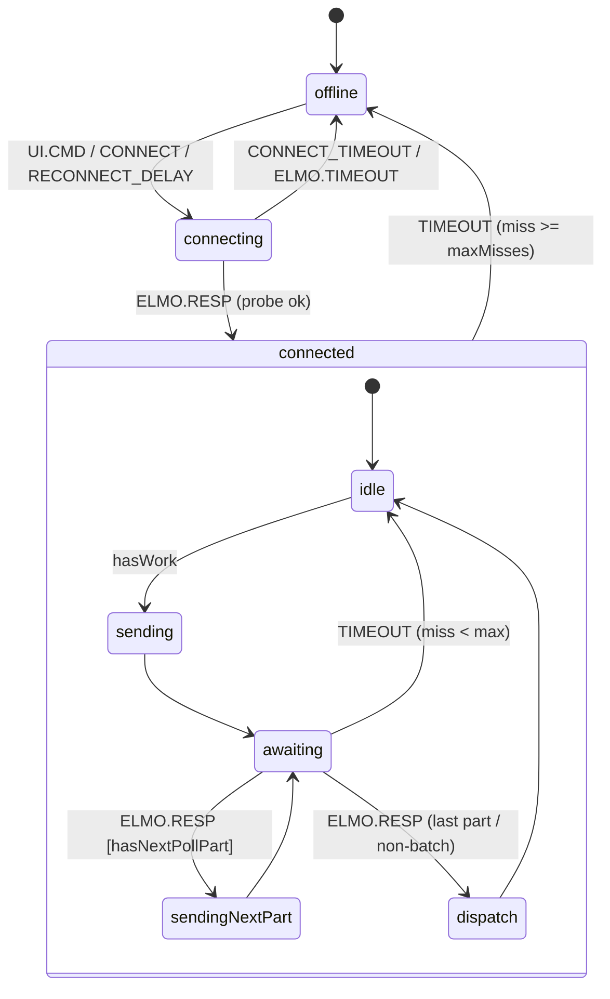

# Справочник пакета `nc3-elmo-machines`

Актуально на: 2026-05-27 (транспорт UDP).

Краткая навигация по коду пакета: что в каком файле и какие основные функции. Без полного кода — за деталями смотреть сами файлы в `packages/nc3-elmo-machines/src/`. Поведение системы целиком описано в [xstate-machine-current-state.md](xstate-machine-current-state.md).

`ElmoTransport` — это **транспортная** XState-машина (единственный владелец UDP-канала к ELMO, очередь, опрос), а не машина всего техпроцесса. Машина чистая: весь ввод-вывод вынесен в инъектируемые `effects`, поэтому её можно тестировать без Node-RED (`node --test`).

## Карта файлов

| Файл | Роль |
|---|---|
| `index.js` | Точка входа пакета: реэкспорт публичного API. |
| `elmoTransport.js` | XState-машина транспорта: состояния, очередь, опрос, ACK/таймауты. |
| `poll.js` | Построение poll-команд (батч в одну датаграмму) и расчёт частоты опроса. |
| `parse.js` | Минимальный парсер скаляров из ответа ELMO (для решений транспорта). |
| `queue.js` | Приоритетная очередь с одним in-flight. |
| `res.js` | Константы разрешения энкодера (ticks/rev и т.п.), пересчёт °↔ticks. |
| `util.js` | Мелкие утилиты (`ensureCr`, `clamp`). |

---

## `index.js`

Реэкспортирует: `createElmoTransport`, `startElmoTransport`, `parseElmoScalars`, `RES`, `ticksPerRev`, `ticksPerDeg`, `degPerSecToTicks`, `priorityInsert`, `dequeue`, `PRIORITY`, `DATA_POLL`, `buildPollEnvelope`, `buildPollCommand`, `buildStatePoll`, `buildFullStatePoll`, `computePollDelayMs`, `omegaDegPerSec`, `computeRateHz`, `ensureCr`.

В Node-RED пакет грузится через `functionGlobalContext` (`global.get('nc3')`), `xstate` остаётся внутренней зависимостью пакета.

---

## `elmoTransport.js`

### Фабрики

| Функция | Назначение |
|---|---|
| `createElmoTransport(effects)` | Собирает и возвращает XState-машину транспорта с заданными эффектами ввода-вывода. |
| `startElmoTransport(effects, input)` | `createActor(...).start()` — создаёт и запускает актор за один вызов (для Node-RED-обвязки). |

### `effects` (инъекция ввода-вывода)

| Эффект | Назначение | Дефолт |
|---|---|---|
| `sendCmd(cmd)` | Отправить одну командную датаграмму (`udp out`). | no-op |
| `forwardResp(raw, topic)` | Переслать сырой ответ в `ResponseParser`/debug с восстановленным topic. | no-op |
| `emitEvent(evt)` | Выдать доменное событие (`CMD.ACKED/FAILED`, `POLL.BAD_FRAME`). | no-op |
| `setStatus(st)` | `node.status({fill,shape,text})`. | no-op |
| `now()` | Часы (инъектируемы в тестах). | `Date.now` |
| `timeoutMs` | Watchdog ожидания ответа на запрос. | `1000` |
| `connectTimeoutMs` | Watchdog ответа на probe в `connecting`. | `2000` |
| `reconnectMs` | Пауза перед повторным probe из `offline`. | `1000` |
| `maxMisses` | Сколько подряд таймаутов до перехода в `offline`. | `3` |
| `statePeriodMs` | Минимальный период state-poll. | `1000` |
| `probeCmd` | Команда liveness-probe на connect. | `TM` |
| `initialFullState` | Ставить ли `full_state` poll после connect. | `true` |
| `pollOptions` | `{ minHz, maxHz, analogParam }` для частоты/payload. | `{}` |

`input`: `{ resolution, pollConfig }` (стартовое разрешение и настройки fast-raw записи).

### Контекст (основное)

`queue` (приоритетная очередь), `inFlight` (единственный текущий запрос), `resolution`, `vx`, `omegaSource` (`measured`/`setpoint`), `setpointDegS`, `lastExtendedAt`, `missCount` (счётчик подряд пропущенных ответов), `pollConfig`/`fastRawActive`, `fastStable`/`fastStableCount`/`lastFastVx`/`lastFastPollStartedAt`.

### Guards / delays

| Имя | Тип | Назначение |
|---|---|---|
| `hasWork` | guard | В очереди есть запрос. |
| `tooManyMisses` | guard | После инкремента число пропусков достигнет `maxMisses` (предсказывает до actions). |
| `hasNextPollPart` | guard | Текущий poll — батч атомарных команд, только что пришедшая часть валидна и есть ещё команды. |
| `POLL_DELAY` | delay | Задержка до следующего самотактируемого poll (`computePollDelayMs`). |
| `TIMEOUT` | delay | Watchdog ответа = `timeoutMs`. |
| `CONNECT_TIMEOUT` | delay | Watchdog probe = `connectTimeoutMs`. |
| `RECONNECT_DELAY` | delay | Пауза в `offline` перед повторным probe = `reconnectMs`. |

### Actions (основные)

| Action | Назначение |
|---|---|
| `enqueueCmd` | Положить команду в очередь; при `setpointDegS` включить setpoint-источник скорости. |
| `enqueuePoll` | Поставить data- (и при необходимости state-) poll; в fast-режиме — `fast_seek`/`fast_data`; dedup по роли. |
| `enqueueFullStatePoll` / `enqueueInitialFullStatePoll` | Поставить полный диагностический poll (вручную / после connect). |
| `enqueueConfirmPoll` | После команды, меняющей состояние (`MO=`, `OL[1]=`…), поставить подтверждающий poll. |
| `enqueueDiagnosticOnBadPoll` | На невалидный fast-кадр поставить `full_state` (высокий приоритет) и сбросить fast-стабильность. |
| `takeNext` | Снять головной запрос из очереди в `inFlight`; для fast-poll зафиксировать `lastFastPollStartedAt`. |
| `sendInFlight` / `sendProbe` | Отправить через `sendCmd` команду текущего запроса (атомарная команда `cmds[cursor]` для poll) / probe. |
| `collectPollPart` | Принять валидную часть атомарного poll: добавить raw в `parts`, инкрементировать `cursor`. |
| `ingestResp` | Из РЕАССЕМБЛИРОВАННОГО `rawFor(env, raw)` обновить поля контекста (vx, resolution, mo/so/sr…) и fast-стабильность. Не заменяет `ResponseParser`. |
| `forwardAndAck` | Валидировать через `responseValidation`; невалидный → `POLL.BAD_FRAME` (с `part`/`cmd` сбойной части); валидный → `forwardResp` склеенного `raw` + (для команд) `CMD.ACKED`. |
| `failInFlight` | Для команды выдать `CMD.FAILED` (reason `timeout`). |
| `bumpMiss` / `resetMiss` | Инкремент/сброс счётчика пропусков. |
| `freeInFlight` | Очистить `inFlight`. |
| `configurePoll` | Применить `POLL.CONFIG` (fast-raw настройки). |
| `statusOffline/Connecting/Idle/Busy` | `node.status(...)`. |

### Внутренние хелперы (кратко)

`normalizeEnvelope` (нормализация конверта команды/poll), `pollRoleOf`/`topicFor`/`isAckable`, `hasPollRole`/`hasAnyFastPoll`/`…InFlight` (dedup), `isBatchPoll`/`cursorOf`/`commandFor`/`rawFor` (многочастный атомарный poll: какая команда сейчас и как склеить части), `validatePollResponse` / `validateCurrentPollPart` / `responseValidation` (проверка целого кадра, текущей части, и их комбинации), `confirmPollRoleFor` (какой confirm-poll нужен после команды), `fastStabilityPatch` (счётчик стабильной скорости), `normalizePollConfig`/`shouldFastPoll`/`fastPollRoleFor`.

### Состояния

- `offline` — нет связи; сам перезапрашивает probe через `RECONNECT_DELAY` (UDP self-heal).
- `connecting` — отправлен probe (`TM`), ждём любой ответ.
- `connected.idle` — простой; через `POLL_DELAY` сам ставит poll; при `hasWork` → `sending`.
- `connected.sending` — снять запрос и отправить ПЕРВУЮ атомарную команду (для poll) или команду целиком.
- `connected.awaiting` — ждём ответ-датаграмму; если есть ещё атомарные команды этого poll → `sendingNextPart`; иначе → `dispatch`; таймаут → `idle` (или `offline` после `maxMisses`). Сокет не сбрасывается — в UDP его нет.
- `connected.sendingNextPart` — отправить следующую атомарную команду текущего poll и вернуться в `awaiting`.
- `connected.dispatch` — освободить `inFlight`, вернуться в `idle`.

Входные события: `UI.CMD`, `POLL.TICK`, `POLL.FULL_STATE`, `POLL.CONFIG`, `CONNECT`, `ELMO.RESP`, `ELMO.TIMEOUT`.

---

## `poll.js`

UDP, **атомарные команды**: ELMO плохо отвечает на батч (один ответ-датаграмма на параметр и не всегда в порядке), поэтому логический poll = СПИСОК (`cmds`) атомарных команд (`TM`, потом `PX`, потом `VX`), каждая даёт ровно одну датаграмму-ответ. Транспорт собирает части в один логический raw для downstream.

| Функция / константа | Назначение |
|---|---|
| `DATA_POLL` / `LEAN_POLL` | `'TM;PX;VX;'` — display-константа (поля data-poll), не отправляется как одна строка. |
| `buildPollFields(role, options)` | Список полей роли (`data`/`state`/`full_state`/`fast_seek`/`fast_data`); `analogParam` опционально для full_state. |
| `buildStatePoll` / `buildFullStatePoll` (`buildExtendedPoll`) | Текстовое представление полей (display). |
| `buildPollEnvelope(args)` | Конверт poll: `cmds` (атомарные команды), `cursor`/`parts` для пошаговой сборки, `cmd = cmds[0]`, `required` (для итоговой валидации), `partRequired` (для проверки каждой части), `priority`, `pollRole`, `meta.topic`. |
| `shouldExtend(lastExtendedAt, now, statePeriodMs)` | Пора ли добавить медленный state-poll. |
| `omegaDegPerSec(vx, resolution)` | `VX` (ticks/s) → °/с по разрешению. |
| `computeRateHz(omega, options)` | `clamp(\|ω\|/12, minHz, maxHz)` — 30 точек/оборот, не ниже 1 Гц. |
| `computePollDelayMs(context, options)` | Задержка до следующего poll; в fast-режиме — start-to-start от `fastRawPollHz`. `options.timerCompensationMs` (дефолт 0) вычитается из результата — компенсация гранулярности `setTimeout` Windows (~15.625 мс); значение ~8 мс убирает один потерянный тик и поднимает фактическую частоту fast-poll с ~22 до ~32 Гц при цели 30 Гц. |

Роли poll: `data` (`TM`, `PX`, `VX`), `state` (`MO`, `SO`, `SR`), `full_state` (`MS`, `MO`, `SO`, `SR`, `AF`, `OL[1]`, `OL[2]`), `fast_seek` (`VX`, `PX`), `fast_data` (`VX`, `PX`, `TM`). Topic наружу: `poll_data` / `poll_state` / `poll_fast`.

---

## `parse.js`

| Функция | Назначение |
|---|---|
| `parseElmoScalars(raw)` | Достаёт из сырого ответа только нужные транспорту скаляры (`TM,PX,VX,MS,MO,SO,SR,AF,OL[1],OL[2]`). Понимает `PARAM=VALUE`, `PARAM;VALUE`, `PARAM\rVALUE`; для дублей берёт последнее. `OL[1]` задаёт `resolution` (`1→low`). Возвращает только присутствующие поля. Не заменяет доменный `ResponseParser`. |

---

## `queue.js`

Единая сериализованная очередь, один in-flight. Приоритет: `cmd`/`init`(3) > `fastPoll`(2.5) > `tilt`(2) > `poll`(1), стабильный FIFO внутри приоритета.

| Функция / константа | Назначение |
|---|---|
| `PRIORITY` | Карта приоритетов по `kind`. |
| `priorityOf(env)` | Приоритет конверта (явный или по `kind`). |
| `priorityInsert(queue, env)` | Вставка с сохранением сортировки по убыванию приоритета. |
| `dequeue(queue)` | `{ inFlight, queue }` — снять голову. |
| `hasKind(queue, kind)` | Есть ли в очереди конверт данного `kind`. |

---

## `res.js`

Константы разрешения энкодера (зеркало `CommandHandler.RES` в `flows.json`) — общий источник истины для ticks/rev и команд `set_resolution`.

| Функция / константа | Назначение |
|---|---|
| `RES` | Параметры `high`/`low` (ca18, sp_def, vh2 и т.д.). |
| `resKey(resolution)` | Нормализует к `'high'`/`'low'`. |
| `ticksPerRev(resolution)` | Тиков на оборот (CA[18]). |
| `ticksPerDeg(resolution)` | Тиков на градус. |
| `degPerSecToTicks(degPerSec, resolution)` | °/с → ticks/s (округление). |

---

## `util.js`

| Функция | Назначение |
|---|---|
| `ensureCr(cmd)` | Гарантирует завершающий `CR` (ELMO Direct Access требует CR). |
| `clamp(value, min, max)` | Ограничение в диапазон. |

---

## Тесты

`packages/nc3-elmo-machines/test/` (`node --test`): `elmoTransport.test.js` (поведение машины: connect/poll/ACK/таймауты/fast-raw/offline), `helpers.test.js` (poll/queue/res/util), `parse.test.js` (парсер). Эффекты и часы мокаются, путь таймаута проверяется инъекцией события `ELMO.TIMEOUT`.

## Node-RED интеграция

Вкладка `ELMO XState (UDP)` в `flows.json`; эквивалентный генератор — `flows/elmo-xstate-udp/build-flow.js`. Поток и тестовые inject-узлы описаны в [xstate-machine-current-state.md](xstate-machine-current-state.md).
