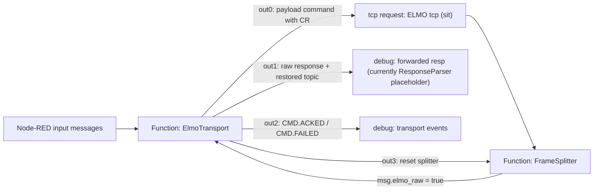

# Архитектура текущей XStateMachine ELMO

Актуально на: 2026-05-26.

Статус: описание фактической реализации, которая сейчас находится в локальном Node-RED проекте. Это не план и не целевая архитектура. Если ниже написано, что чего-то нет, значит этого нет в текущем коде `packages/nc3-elmo-machines` и/или в текущей обвязке `flows.json`.

Основные файлы:

- `packages/nc3-elmo-machines/src/elmoTransport.js` - XState v5 машина `ElmoTransport`.
- `packages/nc3-elmo-machines/src/queue.js` - приоритетная очередь запросов.
- `packages/nc3-elmo-machines/src/poll.js` - построение poll-команд и расчет динамической частоты опроса.
- `packages/nc3-elmo-machines/src/parse.js` - минимальный парсер скалярных полей ELMO для внутренних решений транспорта.
- `packages/nc3-elmo-machines/src/frameSplitter.js` - разбиение TCP byte stream на полные ELMO-кадры.
- `packages/nc3-elmo-machines/src/res.js` - параметры high/low разрешения энкодера и конвертация единиц.
- `packages/nc3-elmo-machines/src/util.js` - мелкие утилиты.
- `packages/nc3-elmo-machines/src/index.js` - публичный экспорт локального пакета.
- `flows.json` - фактическая интеграция машины в Node-RED на вкладке `ELMO XState (sit)`.

---

## 1. Задача текущей реализации

Текущая XStateMachine решает только задачу транспортного слоя ELMO:

1. Сделать один сериализованный владелец TCP-обмена с ELMO.
2. Не допускать нескольких одновременных in-flight запросов.
3. Пропускать все команды и poll через одну очередь.
4. Восстанавливать логическую принадлежность ответа текущему запросу.
5. Пересылать raw-ответы дальше в существующий парсер/отладку.
6. Генерировать `CMD.ACKED` / `CMD.FAILED` для ackable-команд.
7. Динамически планировать poll по скорости.
8. Сбрасывать TCP-соединение и буфер фреймов при timeout/fault.

Эта машина не является полной машиной технологического процесса центрифуги. Она не управляет сценарием, не реализует `Drive Init` как отдельную последовательность, не знает о пользовательских режимах "готов", "разгон", "удержание", "запись протокола" и не заменяет существующий `ResponseParser`.

---

## 2. Общая архитектура

Текущая архитектура состоит из двух уровней:

1. Локальный Node.js пакет `nc3-elmo-machines`.
2. Node-RED Function nodes, которые подключают этот пакет к реальному TCP request node.

Пакет содержит чистую бизнес-логику транспорта. Он не импортирует Node-RED API, не вызывает `node.send`, не знает о wiring flow и не работает напрямую с TCP. Все внешние эффекты передаются через объект `effects`.

Node-RED слой делает обратное: он не реализует состояние транспорта вручную. Он создает actor, передает ему события и реализует эффекты `sendTcp`, `resetTcp`, `forwardResp`, `emitEvent`, `setStatus`.

Схема текущей интеграции:



Фактический TCP node:

- id: `elmoxs-tcp`
- name: `ELMO tcp (sit)`
- server: `192.168.1.2`
- port: `2000`
- `out: "sit"`
- `ret: "string"`
- `trim: false`

Режим `sit` означает, что TCP node держит соединение открытым и возвращает входящие данные как поток. Поэтому отдельно нужен `FrameSplitter`.

---

## 3. Почему машина вынесена в локальный пакет

В README проекта зафиксировано правило: код Node-RED Function node - это тело функции, а не CommonJS/ESM модуль. Внутри flow-функций нельзя использовать `require`, `module.exports`, `import`, `export`.

Поэтому реализация сделана как локальный пакет:

```text
packages/nc3-elmo-machines
```

Node-RED получает пакет через `functionGlobalContext` как `global.nc3`, а Function node делает:

```js
const nc3 = global.get('nc3');
```

Так XState остается внутри пакета, а Function node только вызывает публичные фабрики:

- `nc3.startElmoTransport(...)`
- `nc3.createFrameSplitter(...)`

Это сделано для трех причин:

1. Соблюсти правила Node-RED Function node.
2. Держать XState-код тестируемым обычным `node --test`.
3. Не размазывать state machine по JSON flow.

---

## 4. Публичный API пакета

Файл: `packages/nc3-elmo-machines/src/index.js`.

Экспортирует:

| Экспорт | Источник | Назначение |
|---|---|---|
| `createElmoTransport` | `elmoTransport.js` | Создать XState machine definition без запуска actor. Используется для тестов и тонкого контроля. |
| `startElmoTransport` | `elmoTransport.js` | Создать actor из машины и сразу запустить его. Используется Node-RED Function node. |
| `createFrameSplitter` | `frameSplitter.js` | Создать буферизатор TCP stream для режима `sit`. |
| `parseElmoScalars` | `parse.js` | Минимально извлечь `VX`, `OL[1]`, `SO`, `MS`, `SR` из raw-ответа. |
| `RES` | `res.js` | Таблица high/low параметров ELMO. |
| `ticksPerRev` | `res.js` | Вернуть ticks/rev для текущего разрешения. |
| `ticksPerDeg` | `res.js` | Вернуть ticks/degree. |
| `degPerSecToTicks` | `res.js` | Перевести deg/s в ticks/s. |
| `priorityInsert` | `queue.js` | Вставить envelope в очередь по приоритету. |
| `dequeue` | `queue.js` | Забрать первый envelope из очереди. |
| `PRIORITY` | `queue.js` | Таблица приоритетов. |
| `buildPollEnvelope` | `poll.js` | Построить envelope для poll. |
| `computePollDelayMs` | `poll.js` | Рассчитать задержку до следующего poll. |
| `omegaDegPerSec` | `poll.js` | Перевести `VX` в deg/s. |
| `computeRateHz` | `poll.js` | Рассчитать poll rate в Hz. |
| `ensureCr` | `util.js` | Добавить `\r` в конец команды, если его нет. |

---

## 5. `createElmoTransport(effects)`

Файл: `packages/nc3-elmo-machines/src/elmoTransport.js`.

Это главная фабрика. Она возвращает XState v5 machine definition:

```js
return setup(...).createMachine(...)
```

Функция принимает объект `effects`. Через него машина получает все внешние зависимости.

### 5.1. Зачем используется dependency injection через `effects`

Машина не должна сама отправлять TCP, писать Node-RED status или знать о `node.send`. Поэтому все I/O вынесено наружу:

- в тестах эффекты заменяются mock-функциями;
- в Node-RED эффекты реализуются через `node.send`, `node.status`, `setTimeout`;
- сама машина остается детерминированной и пригодной для unit-тестов.

### 5.2. Поддерживаемые effects

| Effect | Реализация по умолчанию | Реальная роль |
|---|---|---|
| `sendTcp(cmd)` | no-op | Отправить строку команды в единственный TCP request node. |
| `resetTcp()` | no-op | Сбросить TCP request и очистить FrameSplitter при fault/timeout. |
| `forwardResp(raw, topic)` | no-op | Переслать raw-ответ дальше с восстановленным logical topic. |
| `emitEvent(evt)` | no-op | Выдать доменное событие, например `CMD.ACKED` или `CMD.FAILED`. |
| `setStatus(status)` | no-op | Установить статус Node-RED Function node. |
| `now()` | `Date.now()` | Инжектируемые часы для расчета extended poll и тестов. |
| `timeoutMs` | `180` | Watchdog одного in-flight запроса внутри пакета. |
| `connectTimeoutMs` | `1000` | Watchdog подключения/probe внутри пакета. |
| `statePeriodMs` | `1000` | Период расширенного poll. |
| `probeCmd` | `TM;PX;VX;` | Команда probe при входе в `connecting`. |
| `pollOptions` | `{}` | Настройки poll: `minHz`, `maxHz`, `analogParam`. |

В текущей Node-RED обвязке значения переопределены:

```js
timeoutMs: 1000,
connectTimeoutMs: 2000,
statePeriodMs: 1000
```

То есть дефолт пакета `180 ms` сейчас не используется в flow. Реально в Node-RED стоит `1000 ms` на запрос и `2000 ms` на connect.

---

## 6. Внутренние helper-функции `elmoTransport.js`

### 6.1. `nextId()`

```js
let seq = 0;
const nextId = () => 'e' + (++seq);
```

Генерирует локальные id envelope, если id не пришел извне.

Зачем нужно:

- у каждой команды должен быть id для `CMD.ACKED` / `CMD.FAILED`;
- poll тоже получает id, хотя ack для poll не генерируется;
- тесты и внешние сценарии могут передавать свой id, тогда автогенерация не используется.

Ограничение: счетчик живет внутри одного actor instance. После перезапуска Function node sequence начинается заново.

### 6.2. `normalizeEnvelope(env)`

Превращает внешний `event.envelope` в нормализованный внутренний envelope.

Возвращаемая форма:

```js
{
  id,
  kind,
  priority,
  cmd,
  expect,
  meta
}
```

Правила:

- если `env` пустой, создается envelope с `kind: 'cmd'`;
- `id` берется из `src.id`, иначе генерируется через `nextId()`;
- `kind` берется из `src.kind`, иначе `cmd`;
- `priority` берется из `src.priority`, если это число;
- иначе priority берется из `PRIORITY[kind]`;
- если kind неизвестен, priority будет `0`;
- `expect` берется из `src.expect`, иначе:
  - для `poll` - `parse`;
  - для остальных - `ack`;
- `meta` берется из `src.meta`, иначе `{}`.

Зачем нужно:

- все входящие команды приводятся к одному контракту;
- очередь работает только с envelope;
- XState не зависит от формы UI-сообщения напрямую.

Важное ограничение: функция не валидирует `cmd`. Если пришел envelope без `cmd`, он может попасть в очередь. Реальный `sendInFlight` отправит `undefined` только если такой envelope был принят. Сейчас защита от пустой строки есть в Node-RED On Message для ручного `msg.payload`, но не внутри `normalizeEnvelope`.

### 6.3. `topicFor(env)`

Определяет logical topic для пересылки raw-ответа.

Правила:

1. Если есть `env.meta.topic`, вернуть его.
2. Если `env.kind === 'poll'`, вернуть `poll_data`.
3. Иначе вернуть `undefined`.

Зачем нужно:

- TCP node получает просто строку команды и не знает, к какому логическому потоку она относится;
- при одном in-flight ответ принадлежит текущему envelope;
- topic можно восстановить из envelope и отдать дальше в ResponseParser/отладку.

Практический эффект:

- manual command с topic `set_velocity` вернет raw-ответ с topic `set_velocity`;
- poll всегда уходит дальше как `poll_data`;
- если topic не задан и kind не poll, Node-RED wrapper подставляет `poll_data` как fallback в `forwardResp`.

### 6.4. `isAckable(env)`

```js
return env && (env.kind === 'cmd' || env.kind === 'tilt');
```

Определяет, нужно ли генерировать `CMD.ACKED` / `CMD.FAILED`.

Ackable сейчас только:

- `cmd`
- `tilt`

Не ackable:

- `poll`
- `init`
- любые неизвестные kind.

Зачем нужно:

- poll не должен засорять поток доменных ACK-событий;
- команды управления и tilt должны иметь подтверждение для будущего сценарного слоя.

Ограничение: `init` имеет приоритет в очереди, но не имеет отдельной семантики ack/fail. Отдельных `INIT.DONE` / `INIT.FAILED` сейчас нет.

---

## 7. Контекст машины

Начальный context:

```js
{
  queue: [],
  inFlight: null,
  resolution: input.resolution || 'high',
  vx: 0,
  omegaSource: 'measured',
  setpointDegS: 0,
  lastExtendedAt: 0
}
```

Поля:

| Поле | Тип/значение | Назначение |
|---|---|---|
| `queue` | массив envelope | Очередь ожидающих запросов. |
| `inFlight` | envelope или `null` | Единственный запрос, отправленный в TCP и ожидающий ответа. |
| `resolution` | `'high'` или `'low'` | Текущий диапазон/разрешение энкодера. Используется для пересчета `VX`. |
| `vx` | число | Последний измеренный `VX` из ELMO в ticks/s. |
| `omegaSource` | `'measured'` или `'setpoint'` | Источник скорости для расчета poll delay. |
| `setpointDegS` | число | Уставка скорости в deg/s, используется до первого нового `VX`. |
| `lastExtendedAt` | timestamp ms | Когда последний раз был поставлен extended poll. |

В Node-RED actor создается с input:

```js
{ resolution: ckpt.resolution || 'high' }
```

`ckpt` берется из node context `elmo_checkpoint`. Это только стартовая подсказка до первого poll. Реальное разрешение позже переопределяется из `OL[1]`.

---

## 8. Guards и delays

### 8.1. Guard `hasWork`

```js
hasWork: ({ context }) => context.queue.length > 0
```

Используется только в `connected.idle`.

Зачем нужно:

- когда actor входит в `idle`, он сразу проверяет очередь;
- если очередь не пуста, машина не остается в idle, а мгновенно идет в `sending`.

Это основной механизм автодиспетчеризации очереди.

### 8.2. Delay `POLL_DELAY`

```js
POLL_DELAY: ({ context }) => computePollDelayMs(context, pollOptions)
```

Задержка до self-clocked poll в состоянии `connected.idle`.

Зачем нужно:

- poll не идет фиксированным interval node;
- машина сама планирует следующий poll в зависимости от скорости;
- если транспорт занят командами, poll не мешает in-flight запросу.

### 8.3. Delay `TIMEOUT`

```js
TIMEOUT: () => timeoutMs
```

Watchdog текущего in-flight запроса.

В пакете по умолчанию: `180 ms`.

В текущей Node-RED обвязке: `1000 ms`.

### 8.4. Delay `CONNECT_TIMEOUT`

```js
CONNECT_TIMEOUT: () => connectTimeoutMs
```

Watchdog ответа на probe-команду в `connecting`.

В пакете по умолчанию: `1000 ms`.

В текущей Node-RED обвязке: `2000 ms`.

---

## 9. Actions машины

### 9.1. `enqueueCmd`

Код:

```js
enqueueCmd: assign(({ context, event }) => {
  const env = normalizeEnvelope(event.envelope);
  const patch = { queue: priorityInsert(context.queue, env) };
  const sp = env.meta && env.meta.setpointDegS;
  if (sp != null && Number.isFinite(Number(sp))) {
    patch.omegaSource = 'setpoint';
    patch.setpointDegS = Number(sp);
  }
  return patch;
})
```

Что делает:

1. Берет `event.envelope`.
2. Нормализует его.
3. Вставляет в очередь по приоритету.
4. Если в `meta.setpointDegS` есть число, переключает poll scheduler на уставку скорости.

Зачем нужно:

- все UI/manual/scenario команды должны проходить через одну очередь;
- команда скорости может резко изменить скорость до того, как первый `VX` это подтвердит;
- чтобы poll не оставался медленным на разгоне, используется fallback на `setpointDegS`.

Ограничение: `enqueueCmd` не проверяет состояние привода и не запрещает команды. CommandGate пока не реализован.

### 9.2. `ingestResp`

Код:

```js
ingestResp: assign(({ context, event }) => {
  const f = parseElmoScalars(event.raw);
  const patch = {};
  if (f.vx !== undefined) { patch.vx = f.vx; patch.omegaSource = 'measured'; }
  if (f.resolution) patch.resolution = f.resolution;
  if (f.so !== undefined) patch.so = f.so;
  if (f.ms !== undefined) patch.ms = f.ms;
  if (f.sr !== undefined) patch.sr = f.sr;
  return patch;
})
```

Что делает:

- парсит raw-ответ через `parseElmoScalars`;
- обновляет только поля, которые нужны самому транспортному слою:
  - `vx`
  - `omegaSource`
  - `resolution`
  - `so`
  - `ms`
  - `sr`

Зачем нужно:

- транспорту нужно знать скорость для динамического poll;
- транспорту нужно знать `resolution`, чтобы правильно пересчитывать `VX`;
- `SO/MS/SR` уже сохраняются в context как подготовка к будущим решениям, но текущая машина по ним переходы не делает.

Важная граница: это не замена `ResponseParser`. Полный drive state здесь не строится. Raw-ответ все равно пересылается дальше.

### 9.3. `enqueuePoll`

Что делает:

1. Проверяет, нет ли уже poll в очереди.
2. Проверяет, не является ли текущий `inFlight` poll.
3. Если poll уже есть, возвращает пустой patch.
4. Берет текущее время через `now()`.
5. Определяет, нужен ли extended poll:
   ```js
   shouldExtend(context.lastExtendedAt, t, statePeriodMs)
   ```
6. Создает poll envelope через `buildPollEnvelope`.
7. Вставляет poll в очередь.
8. Если poll extended, обновляет `lastExtendedAt`.

Зачем нужно:

- не допустить накопления poll-команд в очереди;
- poll должен уступать ручным/сценарным командам;
- extended poll должен приходить примерно раз в `statePeriodMs`, а обычный lean poll может идти чаще.

Дедупликация важна: если TCP занят, частые `POLL.TICK` не создают хвост из десятков poll.

### 9.4. `takeNext`

```js
const { inFlight, queue } = queueDequeue(context.queue);
return { inFlight, queue };
```

Что делает:

- забирает первый envelope из очереди;
- кладет его в `context.inFlight`;
- остаток возвращает в `context.queue`.

Зачем нужно:

- отделить "запрос уже отправляется/ожидается" от "запрос еще ждет";
- именно `inFlight` используется для корреляции ответа.

### 9.5. `sendInFlight`

```js
if (context.inFlight) sendTcp(context.inFlight.cmd);
```

Что делает:

- отправляет `inFlight.cmd` наружу через effect `sendTcp`.

Зачем нужно:

- XState action не знает про Node-RED;
- в тестах можно проверить, какая команда была отправлена;
- в Node-RED команда уйдет в out0 TCP request.

Ограничение: если `inFlight.cmd` пустой или `undefined`, action сам это не отфильтрует.

### 9.6. `sendProbe`

```js
sendTcp(probeCmd);
```

Что делает:

- при входе в `connecting` отправляет probe-команду.

По умолчанию:

```text
TM;PX;VX;
```

Зачем нужно:

- проверить, что TCP обмен живой;
- не переводить машину в `connected`, пока не пришел ответ от ELMO.

Важное поведение: ответ на probe в `connecting` не проходит через `ingestResp` и не пересылается в `forwardResp`. Он только подтверждает, что связь есть.

### 9.7. `forwardAndAck`

Что делает:

1. Берет текущий `context.inFlight`.
2. Пересылает `event.raw` наружу через `forwardResp(raw, topicFor(env))`.
3. Если envelope ackable, генерирует:
   ```js
   { type: 'CMD.ACKED', id: env.id, raw: event.raw }
   ```

Зачем нужно:

- один raw-ответ должен одновременно:
  - освободить транспорт;
  - уйти в ResponseParser/отладку;
  - подтвердить команду будущему сценарному слою.

Важно: poll не генерирует `CMD.ACKED`.

### 9.8. `failInFlight`

Что делает:

- если текущий `inFlight` ackable, генерирует:
  ```js
  { type: 'CMD.FAILED', id: env.id, reason: 'timeout' }
  ```

Зачем нужно:

- сценарный слой или UI должны знать, что команда не получила ответ;
- timeout poll не должен считаться failure пользовательской команды.

Важно: `failInFlight` сам не очищает `inFlight`. Очистка происходит позже через entry action состояния `fault`.

### 9.9. `freeInFlight`

```js
assign({ inFlight: null })
```

Что делает:

- очищает текущий in-flight envelope.

Используется:

- в `dispatch` после успешного ответа;
- в `fault` после timeout/reset.

Зачем нужно:

- после ответа или fault нельзя оставлять старый envelope как активный;
- иначе следующий ответ мог бы быть ошибочно отнесен к старому запросу.

### 9.10. `doReset`

```js
resetTcp();
```

Что делает:

- вызывает внешний reset effect.

В Node-RED этот effect отправляет:

```js
node.send([{ reset: true }, null, null, { reset: true }]);
```

То есть:

- out0: `{ reset: true }` в TCP request;
- out3: `{ reset: true }` в FrameSplitter.

Зачем нужно:

- принудительно сбросить зависшее TCP соединение;
- очистить буфер частичного кадра, чтобы stale bytes не попали в следующий ответ.

### 9.11. Status actions

| Action | Status |
|---|---|
| `statusOffline` | `{ fill: 'red', shape: 'ring', text: 'ELMO offline' }` |
| `statusConnecting` | `{ fill: 'yellow', shape: 'ring', text: 'ELMO connecting' }` |
| `statusIdle` | `{ fill: 'green', shape: 'dot', text: 'ELMO online' }` |
| `statusBusy` | `{ fill: 'blue', shape: 'dot', text: 'ELMO busy' }` |
| `statusFault` | `{ fill: 'red', shape: 'dot', text: 'ELMO fault' }` |

Зачем нужно:

- дать оператору и разработчику быстрый визуальный статус Function node;
- не хранить статус отдельно в flow.

---

## 10. Полная state diagram текущей машины

```mermaid
stateDiagram-v2
    [*] --> offline

    offline: entry / statusOffline
    offline --> connecting: UI.CMD / enqueueCmd
    offline --> connecting: CONNECT

    connecting: entry / statusConnecting; sendProbe
    connecting --> offline: after CONNECT_TIMEOUT
    connecting --> offline: ELMO.TIMEOUT
    connecting --> connected: ELMO.RESP
    connecting --> connecting: UI.CMD / enqueueCmd

    state "fault" as top_fault

    state connected {
        [*] --> idle

        idle: entry / statusIdle
        idle --> idle: after POLL_DELAY / enqueuePoll
        idle --> sending: always [hasWork]
        idle --> idle: UI.CMD / enqueueCmd
        idle --> idle: POLL.TICK / enqueuePoll

        sending: entry / statusBusy; takeNext; sendInFlight
        sending --> awaiting: always
        sending --> sending: UI.CMD / enqueueCmd
        sending --> sending: POLL.TICK / enqueuePoll

        awaiting --> dispatch: ELMO.RESP / ingestResp; forwardAndAck
        awaiting --> top_fault: after TIMEOUT / failInFlight
        awaiting --> top_fault: ELMO.TIMEOUT / failInFlight
        awaiting --> awaiting: UI.CMD / enqueueCmd
        awaiting --> awaiting: POLL.TICK / enqueuePoll

        dispatch: entry / freeInFlight
        dispatch --> idle: always
        dispatch --> dispatch: UI.CMD / enqueueCmd
        dispatch --> dispatch: POLL.TICK / enqueuePoll
    }

    top_fault: entry / statusFault; doReset; freeInFlight
    top_fault --> top_fault: UI.CMD / enqueueCmd
    top_fault --> connected: CLEARED
    top_fault --> connected: ELMO.RESP
    top_fault --> offline: LOST
```



Примечание: в XState `UI.CMD` и `POLL.TICK` объявлены на parent state `connected`, поэтому они принимаются в любом дочернем состоянии `connected`. На диаграмме они явно показаны как self-transition внутри `idle`, `sending`, `awaiting`, `dispatch`, чтобы было видно фактическое поведение: эти события не сбрасывают активный `inFlight`, а только меняют очередь.

---

## 11. Подробное описание состояний

### 11.1. `offline`

Стартовое состояние машины.

Entry:

- `statusOffline`

Обрабатывает:

| Событие | Действие | Следующее состояние |
|---|---|---|
| `UI.CMD` | `enqueueCmd` | `connecting` |
| `CONNECT` | нет | `connecting` |

Игнорирует:

- `POLL.TICK`
- `ELMO.RESP`
- `ELMO.TIMEOUT`
- `CLEARED`
- `LOST`

Смысл:

- связи пока нет;
- первая команда не теряется, а кладется в очередь;
- явный `CONNECT` запускает probe без добавления команды.

### 11.2. `connecting`

Состояние проверки связи.

Entry:

- `statusConnecting`
- `sendProbe`

Probe-команда:

```text
TM;PX;VX;
```

Обрабатывает:

| Событие | Действие | Следующее состояние |
|---|---|---|
| `UI.CMD` | `enqueueCmd` | остается `connecting` |
| `ELMO.RESP` | нет | `connected.idle` |
| `ELMO.TIMEOUT` | нет | `offline` |
| `after CONNECT_TIMEOUT` | нет | `offline` |

Смысл:

- машина не считает себя online, пока не получила ответ;
- команды во время подключения не теряются, а накапливаются;
- после `ELMO.RESP` вход в `connected` идет через initial child `idle`;
- если в очереди уже есть команды, `idle.always [hasWork]` сразу отправит первую.

Важная правда реализации:

- response на probe не парсится;
- response на probe не пересылается наружу;
- `vx/resolution` из probe-ответа не обновятся, даже если они есть в raw.

### 11.3. `connected`

Compound state. Имеет дочерние состояния:

- `idle`
- `sending`
- `awaiting`
- `dispatch`

Parent-level события:

| Событие | Действие | Target |
|---|---|---|
| `UI.CMD` | `enqueueCmd` | targetless |
| `POLL.TICK` | `enqueuePoll` | targetless |

Смысл targetless transitions:

- событие принимается;
- action выполняется;
- текущее child-state не меняется;
- активный `inFlight` не сбрасывается.

Это критично для single in-flight: если команда приходит во время `awaiting`, она просто попадает в очередь и ждет, пока текущий запрос завершится.

### 11.4. `connected.idle`

Свободное состояние внутри online transport.

Entry:

- `statusIdle`

Transitions:

| Триггер | Guard/action | Следующее состояние |
|---|---|---|
| `always` | `[hasWork]` | `sending` |
| `after POLL_DELAY` | `enqueuePoll` | остается `idle` |
| `UI.CMD` | `enqueueCmd` | остается `idle`, затем может сработать `always` |
| `POLL.TICK` | `enqueuePoll` | остается `idle`, затем может сработать `always` |

Смысл:

- если очередь не пуста, idle почти мгновенно пропускается;
- если работы нет, машина ждет динамический `POLL_DELAY`;
- после `POLL_DELAY` poll добавляется в очередь;
- после добавления poll `always [hasWork]` переводит машину в `sending`.

### 11.5. `connected.sending`

Короткое переходное состояние отправки.

Entry:

1. `statusBusy`
2. `takeNext`
3. `sendInFlight`

Transitions:

| Триггер | Следующее состояние |
|---|---|
| `always` | `awaiting` |

Смысл:

- сначала первый envelope из очереди становится `inFlight`;
- затем его `cmd` отправляется в TCP;
- затем машина сразу начинает ждать ответ.

Состояние не ждет внешних событий. Оно существует, чтобы действия отправки были явной фазой statechart.

### 11.6. `connected.awaiting`

Ожидание ответа на текущий `inFlight`.

Transitions:

| Триггер | Actions | Следующее состояние |
|---|---|---|
| `ELMO.RESP` | `ingestResp`, `forwardAndAck` | `dispatch` |
| `ELMO.TIMEOUT` | `failInFlight` | `fault` |
| `after TIMEOUT` | `failInFlight` | `fault` |
| `UI.CMD` | `enqueueCmd` | остается `awaiting` |
| `POLL.TICK` | `enqueuePoll` | остается `awaiting` |

Смысл:

- любой raw-ответ считается ответом на текущий `inFlight`;
- это корректно только при одном in-flight запросе;
- следующие команды во время ожидания не отправляются сразу;
- timeout переводит транспорт в fault.

Важная правда реализации:

- машина не проверяет содержание ответа на ошибки ELMO;
- `;`, `BG`, `:?`, `TM=...` - все это для машины просто `ELMO.RESP`;
- ошибка протокола должна быть распознана внешним парсером или будущей логикой.

### 11.7. `connected.dispatch`

Короткое служебное состояние после успешного ответа.

Entry:

- `freeInFlight`

Transitions:

| Триггер | Следующее состояние |
|---|---|
| `always` | `idle` |

Смысл:

- очистить `inFlight` после успешной обработки ответа;
- вернуться в `idle`;
- если очередь не пуста, `idle.always` сразу отправит следующий envelope.

Так реализован цикл:

```text
idle -> sending -> awaiting -> dispatch -> idle -> ...
```

### 11.8. `fault`

Аварийное состояние транспортного слоя.

Entry:

1. `statusFault`
2. `doReset`
3. `freeInFlight`

Transitions:

| Событие | Действие | Следующее состояние |
|---|---|---|
| `UI.CMD` | `enqueueCmd` | остается `fault` |
| `CLEARED` | нет | `connected.idle` |
| `ELMO.RESP` | нет | `connected.idle` |
| `LOST` | нет | `offline` |

Смысл:

- timeout/fault сбрасывает TCP request;
- stale `inFlight` очищается;
- команды во время fault не теряются, но и не выводят из fault;
- выйти можно через внешний `CLEARED`, через любой хороший `ELMO.RESP`, или уйти в `offline` через `LOST`.

Важная правда реализации:

- `POLL.TICK` в `fault` не обрабатывается;
- `ELMO.RESP` в `fault` не парсится и не пересылается;
- автоматического retry из `fault` нет, если не приходит `CLEARED` или `ELMO.RESP`;
- команды, накопленные в `fault`, начнут отправляться только после возврата в `connected.idle`.

---

## 12. События машины

### 12.1. Входные события

| Событие | Кто отправляет сейчас | Назначение |
|---|---|---|
| `CONNECT` | Node-RED On Start timer или входящее msg.topic `CONNECT` | Запустить подключение/probe. |
| `UI.CMD` | Node-RED Function node при строковом `msg.payload` | Поставить команду в очередь. |
| `POLL.TICK` | Входящее msg.topic `POLL.TICK` или внутренний `after POLL_DELAY` через action | Поставить poll в очередь. |
| `ELMO.RESP` | FrameSplitter после сборки кадра | Сообщить машине raw-ответ ELMO. |
| `ELMO.TIMEOUT` | Может быть отправлено извне; также есть внутренний `after TIMEOUT` | Обработать timeout текущего запроса. |
| `CLEARED` | Предполагаемый внешний сигнал | Выйти из fault в connected. |
| `LOST` | Предполагаемый внешний сигнал | Перейти из fault в offline. |

### 12.2. Выходные эффекты/сообщения

| Машинный effect | Node-RED выход | Реальное сообщение |
|---|---|---|
| `sendTcp(cmd)` | out0 ElmoTransport -> TCP request | `{ payload: ensureCr(cmd) }` |
| `resetTcp()` | out0 ElmoTransport -> TCP request | `{ reset: true }` |
| `resetTcp()` | out3 ElmoTransport -> FrameSplitter | `{ reset: true }` |
| `forwardResp(raw, topic)` | out1 ElmoTransport | `{ topic, payload: raw }` |
| `emitEvent(evt)` | out2 ElmoTransport | `{ topic: evt.type, payload: evt }` |
| `setStatus(st)` | Node status | `node.status(st)` |

---

## 13. Envelope contract

Внутренний envelope:

```js
{
  id: 'cmdA',
  kind: 'cmd',
  priority: 3,
  cmd: 'JV=100;BG',
  expect: 'ack',
  meta: {
    topic: 'set_velocity',
    setpointDegS: 100
  }
}
```

Поддерживаемые kind на уровне очереди:

| Kind | Priority | Ackable | Комментарий |
|---|---:|---|---|
| `cmd` | `3` | да | Обычная команда ELMO. |
| `init` | `3` | нет | Приоритет есть, отдельной init-семантики пока нет. |
| `tilt` | `2` | да | Команды наклона могут получать ACK/FALSE на уровне транспорта. |
| `poll` | `1` | нет | Опрос телеметрии. |
| неизвестный kind | `0` | нет | Технически будет принят, если есть `cmd`. |

---

## 14. Очередь `queue.js`

Файл: `packages/nc3-elmo-machines/src/queue.js`.

### 14.1. `PRIORITY`

```js
const PRIORITY = { cmd: 3, init: 3, tilt: 2, poll: 1 };
```

Зачем нужно:

- ручные/сценарные команды должны идти раньше poll;
- init должен быть на уровне обычной команды;
- tilt ниже cmd, но выше poll.

### 14.2. `priorityOf(envelope)`

Возвращает приоритет envelope.

Правила:

1. Если `envelope.priority` - число, вернуть его.
2. Иначе вернуть `PRIORITY[envelope.kind]`.
3. Если kind неизвестен, вернуть `0`.

Зачем нужно:

- дать внешнему слою возможность явно переопределить priority;
- сохранить дефолтную таблицу приоритетов.

### 14.3. `priorityInsert(queue, envelope)`

Вставляет envelope в копию очереди так, чтобы:

- больший priority шел раньше;
- при одинаковом priority сохранялся FIFO порядок.

Пример:

```text
poll -> cmd -> cmd -> tilt
```

станет:

```text
cmd -> cmd -> tilt -> poll
```

Зачем нужно:

- poll не должен задерживать команды оператора;
- команды одинакового класса не должны менять порядок.

### 14.4. `dequeue(queue)`

Если очередь пустая:

```js
{ inFlight: null, queue: [] }
```

Если очередь не пустая:

```js
{ inFlight: queue[0], queue: queue.slice(1) }
```

Зачем нужно:

- атомарно взять следующий запрос в `inFlight`;
- оставить остаток очереди для последующих отправок.

### 14.5. `hasKind(queue, kind)`

Проверяет, есть ли в очереди envelope заданного kind.

Используется для poll dedup:

```js
hasKind(context.queue, 'poll')
```

---

## 15. Poll scheduler `poll.js`

Файл: `packages/nc3-elmo-machines/src/poll.js`.

### 15.1. `LEAN_POLL`

```js
const LEAN_POLL = 'TM;PX;VX;';
```

Зачем нужно:

- `TM` - timestamp ELMO;
- `PX` - позиция;
- `VX` - скорость для динамического poll и критерия движения.

Lean poll легкий и может идти часто.

### 15.2. `buildExtendedPoll(options)`

Базовая extended команда:

```text
TM;PX;VX;MS;MO;SO;SR;AF;OL[1];OL[2];
```

Если задано:

```js
options.analogParam
```

то оно добавляется в конец:

```text
...;AN[1];
```

Зачем нужно:

- extended poll добавляет состояние привода и health-поля;
- `OL[1]` нужен для определения high/low resolution;
- analog input пока не зашит жестко, потому что точный индекс должен быть подтвержден на стенде.

### 15.3. `shouldExtend(lastExtendedAt, now, statePeriodMs)`

```js
return (now - lastExtendedAt) >= statePeriodMs;
```

Зачем нужно:

- не тащить тяжелый extended payload на каждом poll;
- гарантировать периодический state poll примерно раз в `statePeriodMs`.

### 15.4. `buildPollEnvelope(args)`

Создает envelope:

```js
{
  id: a.id,
  kind: 'poll',
  priority: PRIORITY.poll,
  cmd: a.extended ? buildExtendedPoll(a.options) : LEAN_POLL,
  extended: !!a.extended,
  expect: 'parse',
  meta: { topic: 'poll_data', origin: 'transport' }
}
```

Зачем нужно:

- poll проходит через ту же очередь, что и команды;
- topic `poll_data` восстанавливается при ответе;
- poll имеет низкий приоритет.

### 15.5. `omegaDegPerSec(vx, resolution)`

Формула:

```js
ticksPerRev = ticksPerRev(resolution)
omegaDegSec = abs(vx) / ticksPerRev * 360
```

Зачем нужно:

- ELMO `VX` приходит в ticks/s;
- poll scheduler работает в deg/s;
- high/low resolution имеют разные ticks/rev.

### 15.6. `computeRateHz(omegaDegSec, options)`

Формула:

```js
rate_hz = clamp(abs(omegaDegSec) / 12, minHz, maxHz)
```

Дефолты:

```js
minHz = 1
maxHz = 30
```

Зачем нужно:

- при 360 deg/s получается 30 Hz;
- это соответствует 30 точкам на оборот;
- в покое poll не падает ниже 1 Hz;
- частота не растет выше 30 Hz.

Примеры:

| Скорость | Rate |
|---:|---:|
| `0 deg/s` | `1 Hz` |
| `12 deg/s` | `1 Hz` |
| `120 deg/s` | `10 Hz` |
| `360 deg/s` | `30 Hz` |
| `600 deg/s` | `30 Hz`, clamp |

### 15.7. `computePollDelayMs(context, options)`

Выбирает скорость:

```js
const omega = ctx.omegaSource === 'setpoint'
  ? abs(ctx.setpointDegS)
  : omegaDegPerSec(ctx.vx, ctx.resolution);
```

Затем:

```js
return Math.round(1000 / computeRateHz(omega, options));
```

Зачем нужно:

- после команды скорости poll может ускориться сразу, еще до первого нового `VX`;
- после прихода `VX` машина возвращается к `omegaSource: 'measured'`;
- self-clocked poll подстраивается под реальное движение.

---

## 16. Минимальный парсер `parse.js`

Файл: `packages/nc3-elmo-machines/src/parse.js`.

### 16.1. `matchScalar(raw, name)`

Ищет числовое значение параметра в raw-строке.

Поддерживает формы:

```text
PARAM=VALUE
PARAM;VALUE
```

Учитывает, что имя параметра может содержать спецсимволы regex, например `OL[1]`.

Зачем нужно:

- ELMO ответы могут приходить в разных формах;
- транспорту нужно извлечь только несколько чисел, а не строить полный parser.

### 16.2. `parseElmoScalars(raw)`

Извлекает только:

- `VX` -> `out.vx`
- `OL[1]` -> `out.ol1` и `out.resolution`
- `SO` -> `out.so`
- `MS` -> `out.ms`
- `SR` -> `out.sr`

Правило resolution:

```js
OL[1] === 1 ? 'low' : 'high'
```

Зачем нужно:

- `VX` нужен для poll rate;
- `OL[1]` нужен для пересчета `VX`;
- `SO/MS/SR` нужны как текущие поля состояния привода для будущей логики.

Что намеренно не парсится:

- `TM`
- `PX`
- `MO`
- `AF`
- `OL[2]`
- `AN[...]`
- ошибки ELMO

Это правда текущей реализации. Полный ResponseParser остается внешним.

---

## 17. Resolution helpers `res.js`

Файл: `packages/nc3-elmo-machines/src/res.js`.

### 17.1. `RES`

Содержит две конфигурации:

- `high`
- `low`

Ключевые поля для транспорта:

| Resolution | `ol1` | `ca18` |
|---|---:|---:|
| `high` | `0` | `262144000` |
| `low` | `1` | `6553600` |

`ca18` используется как ticks/rev.

### 17.2. `resKey(resolution)`

```js
return resolution === 'low' ? 'low' : 'high';
```

Зачем нужно:

- любой неизвестный resolution безопасно трактуется как `high`;
- helper-функции не падают на мусорном input.

### 17.3. `ticksPerRev(resolution)`

Возвращает:

```js
RES[resKey(resolution)].ca18
```

Зачем нужно:

- конвертация `VX` ticks/s -> deg/s.

### 17.4. `ticksPerDeg(resolution)`

```js
ticksPerRev(resolution) / 360
```

Зачем нужно:

- конвертация командных скоростей/положений в ticks.

### 17.5. `degPerSecToTicks(degPerSec, resolution)`

```js
Math.round(degPerSec * ticksPerDeg(resolution))
```

Зачем нужно:

- вспомогательная функция для построителей команд и тестов.

---

## 18. Утилиты `util.js`

### 18.1. `ensureCr(cmd)`

```js
const text = String(cmd == null ? '' : cmd);
return text.endsWith('\r') ? text : text + '\r';
```

Зачем нужно:

- ELMO Direct Access команды должны завершаться carriage return;
- внутри транспорта команды хранятся без обязательного CR;
- Node-RED effect нормализует команду перед отправкой в TCP.

В текущем Node-RED wrapper есть локальная копия `ensureCr`, а пакет также экспортирует свою. То есть behavior совпадает, но wrapper не использует экспорт `nc3.ensureCr`.

### 18.2. `clamp(value, min, max)`

Ограничивает число диапазоном.

Используется в `computeRateHz`.

---

## 19. FrameSplitter `frameSplitter.js`

Файл: `packages/nc3-elmo-machines/src/frameSplitter.js`.

Нужен только потому, что текущий TCP node работает в режиме `sit`.

В `sit` TCP request возвращает поток. Ответ может:

- прийти несколькими chunks;
- содержать несколько кадров в одном chunk;
- прийти без ожидаемого терминатора;
- оставить частичный буфер перед reset.

### 19.1. `createFrameSplitter(opts)`

Опции:

| Опция | Дефолт | Назначение |
|---|---|---|
| `terminator` | `'\r'` | Разделитель конца кадра. |
| `stripTerminator` | `true` | Удалять терминатор из возвращаемого frame. |

Внутри хранит:

```js
let buf = '';
```

### 19.2. `push(chunk)`

Что делает:

1. Добавляет chunk к буферу.
2. Пока в буфере есть terminator, вырезает полный frame.
3. Возвращает массив frames.
4. Остаток оставляет в `buf`.

Пример:

```js
push('TM=1;PX=2;') -> []
push('VX=0;\r')    -> ['TM=1;PX=2;VX=0;']
```

Зачем нужно:

- машина должна получать только полные raw-ответы;
- неполные chunks не должны ошибочно считаться `ELMO.RESP`.

### 19.3. `flush()`

Возвращает остаток буфера и очищает его.

Если буфер пуст:

```js
null
```

Зачем нужно:

- в Node-RED wrapper есть idle-gap fallback на 15 ms;
- если терминатор неверный или не приходит, остаток все равно будет отправлен в actor;
- это помогает bring-up, но может быть рискованно при неверном end-of-frame.

### 19.4. `reset()`

Очищает буфер.

Зачем нужно:

- после TCP reset нельзя оставлять старый partial response;
- иначе новый ответ может склеиться со старым хвостом.

### 19.5. `pending`

Getter, возвращающий текущий буфер.

Используется в тестах и может быть полезен для диагностики.

---

## 20. Фактическая Node-RED интеграция

### 20.1. Вкладка

В `flows.json` есть tab:

```text
ELMO XState (sit)
```

Ключевые узлы:

| id | type | name |
|---|---|---|
| `elmoxs-transport` | function | `ElmoTransport` |
| `elmoxs-tcp` | tcp request | `ELMO tcp (sit)` |
| `elmoxs-splitter` | function | `FrameSplitter` |
| `elmoxs-dbg-resp` | debug | `forwarded resp (out1)` |
| `elmoxs-dbg-evt` | debug | `transport events (out2)` |

### 20.2. Function node `ElmoTransport`: On Start

On Start делает:

1. Получает пакет:
   ```js
   const nc3 = global.get('nc3');
   ```
2. Проверяет наличие `nc3.startElmoTransport`.
3. Создает локальную `ensureCr`.
4. Читает checkpoint:
   ```js
   const ckpt = context.get('elmo_checkpoint') || {};
   ```
5. Создает actor:
   ```js
   const actor = nc3.startElmoTransport(effects, { resolution: ckpt.resolution || 'high' });
   ```
6. Подписывается на snapshots:
   ```js
   context.set('transport_state', snap.value);
   ```
7. Если изменился `snap.context.resolution`, сохраняет:
   ```js
   context.set('elmo_checkpoint', { resolution: r });
   ```
8. Кладет actor в node context:
   ```js
   context.set('elmoActor', actor);
   ```
9. Через `setTimeout(..., 0)` отправляет actor событие:
   ```js
   { type: 'CONNECT' }
   ```
10. Сохраняет timer id в `connectTimer`.

Зачем это сделано:

- actor создается один раз при deploy/start узла;
- state machine переживает отдельные сообщения через node context;
- первое подключение запускается после завершения On Start;
- resolution checkpoint ускоряет старт до первого extended poll.

### 20.3. Function node `ElmoTransport`: On Message

Логика:

```js
const actor = context.get('elmoActor');
```

Если actor отсутствует - `node.error`.

Далее mapping:

| Входящее msg | Событие actor |
|---|---|
| `msg.elmo_raw === true` | `{ type: 'ELMO.RESP', raw: msg.payload }` |
| `msg.topic === 'CONNECT'` | `{ type: 'CONNECT' }` |
| `msg.topic === 'POLL.TICK'` | `{ type: 'POLL.TICK' }` |
| `typeof msg.payload === 'string' && msg.payload.length` | `{ type: 'UI.CMD', envelope: { kind: 'cmd', cmd: msg.payload, meta: { topic: msg.topic || 'manual' } } }` |

Зачем это сделано:

- raw TCP response возвращается в actor, а не сразу в parser;
- actor сам решает, какому in-flight принадлежит ответ;
- ручные строки можно отправлять в транспорт для bring-up.

Ограничение:

- сейчас On Message строит только `kind: 'cmd'`;
- `tilt`, `init`, `setpointDegS` через эту простую обвязку не формируются;
- они возможны на уровне пакета, но текущий flow их не подает.

### 20.4. Function node `ElmoTransport`: effects

`sendTcp`:

```js
sendTcp: function (cmd) {
  node.send([{ payload: ensureCr(cmd) }, null, null, null]);
}
```

Назначение:

- out0 идет в `ELMO tcp (sit)`;
- команда получает финальный `\r`.

`resetTcp`:

```js
resetTcp: function () {
  node.send([{ reset: true }, null, null, { reset: true }]);
}
```

Назначение:

- out0 сбрасывает TCP request;
- out3 сбрасывает FrameSplitter.

`forwardResp`:

```js
forwardResp: function (raw, topic) {
  node.send([null, { topic: topic || 'poll_data', payload: raw }, null, null]);
}
```

Назначение:

- out1 получает raw response с восстановленным topic.

Текущая фактическая wiring-цель out1 - debug node `forwarded resp (out1)`. В плане это место должно идти в существующий `ResponseParser`.

`emitEvent`:

```js
emitEvent: function (evt) {
  node.send([null, null, { topic: evt.type, payload: evt }, null]);
}
```

Назначение:

- out2 получает события `CMD.ACKED` / `CMD.FAILED`.

Текущая фактическая wiring-цель out2 - debug node `transport events (out2)`.

`setStatus`:

```js
setStatus: function (st) { node.status(st); }
```

Назначение:

- пробрасывает статусы машины в Node-RED editor.

### 20.5. Function node `ElmoTransport`: On Stop

```js
const actor = context.get('elmoActor');
if (actor) actor.stop();
const ct = context.get('connectTimer');
if (ct) clearTimeout(ct);
```

Зачем нужно:

- корректно остановить XState actor при deploy/stop;
- очистить connect timer.

### 20.6. Function node `FrameSplitter`: On Start

Получает пакет:

```js
const nc3 = global.get('nc3');
```

Создает splitter:

```js
context.set('splitter', nc3.createFrameSplitter({ terminator: '\r' }));
```

Зачем нужно:

- TCP в режиме `sit` не режет сообщения на полные ELMO-кадры;
- splitter хранится в node context между chunks.

### 20.7. Function node `FrameSplitter`: On Message

Если приходит reset:

```js
if (msg.reset === true) {
  splitter.reset();
  clearTimeout(idleTimer);
  return null;
}
```

Иначе:

1. `splitter.push(msg.payload)` возвращает frames.
2. Каждый frame отправляется в ElmoTransport:
   ```js
   node.send({ elmo_raw: true, payload: frames[i] });
   ```
3. Сбрасывается старый idle timer.
4. Ставится новый idle timer на `15 ms`.
5. По idle timer вызывается `flush()`.
6. Если остаток не пустой, он тоже отправляется как `{ elmo_raw: true, payload: rem }`.

Зачем нужен idle-gap fallback:

- если терминатор `\r` не пришел, bring-up все еще может получить response;
- поскольку in-flight один, остаток после короткой тишины с высокой вероятностью относится к текущему запросу.

Риск:

- если реальный end-of-frame длиннее или chunks приходят с паузами больше 15 ms, flush может преждевременно отправить неполный кадр.

### 20.8. Function node `FrameSplitter`: On Stop

Очищает `idleTimer`.

---

## 21. Реальные потоки исполнения

### 21.1. Старт без пользовательской команды

```mermaid
sequenceDiagram
    participant NR as Node-RED On Start
    participant A as ElmoTransport Actor
    participant TCP as tcp request
    participant FS as FrameSplitter

    NR->>A: CONNECT
    A->>TCP: TM;PX;VX;\r
    TCP->>FS: raw chunk(s)
    FS->>A: ELMO.RESP(raw)
    A->>A: connecting -> connected.idle
```

После этого, если очередь пустая, `idle` сам ждет `POLL_DELAY` и ставит poll.

### 21.2. Первая команда из offline

```mermaid
sequenceDiagram
    participant UI as Input msg
    participant A as Actor
    participant TCP as tcp request
    participant FS as FrameSplitter

    UI->>A: UI.CMD(envelope)
    A->>A: offline -> connecting, enqueueCmd
    A->>TCP: probe TM;PX;VX;\r
    FS->>A: ELMO.RESP(probe)
    A->>A: connected.idle -> sending
    A->>TCP: queued command\r
    FS->>A: ELMO.RESP(command response)
    A->>A: ingestResp; forwardAndAck; dispatch; idle
```

Ключевое: команда не теряется во время подключения. Она ждет в `queue`.

### 21.3. Команда во время poll

```text
connected.awaiting, inFlight = poll
UI.CMD arrives
-> enqueueCmd
-> machine stays awaiting
poll response arrives
-> dispatch clears poll
-> idle sees queue has cmd
-> sending sends cmd
```

Ключевое: команда не прерывает текущий TCP запрос. Она будет отправлена сразу после завершения poll.

### 21.4. Timeout команды

```text
connected.awaiting, inFlight = cmd
after TIMEOUT or ELMO.TIMEOUT
-> failInFlight emits CMD.FAILED
-> fault entry sets status, resetTcp, freeInFlight
```

В Node-RED `resetTcp` одновременно:

- сбрасывает TCP node;
- очищает FrameSplitter.

### 21.5. Восстановление из fault

Вариант 1:

```text
fault + CLEARED -> connected.idle
```

Вариант 2:

```text
fault + ELMO.RESP -> connected.idle
```

Вариант 3:

```text
fault + LOST -> offline
```

Команды, которые были поставлены в очередь во время fault, после `connected.idle` начнут выполняться.

---

## 22. Что покрыто тестами

Тесты лежат в:

```text
packages/nc3-elmo-machines/test
```

### 22.1. `elmoTransport.test.js`

Покрывает:

- `offline -> connecting -> connected -> send first queued cmd`;
- ACK in-flight команды и восстановление topic;
- single in-flight: вторая команда ждет первую;
- timeout -> fault -> `CMD.FAILED` -> reset -> recover;
- auto recover from fault on `ELMO.RESP`;
- `POLL.TICK` ставит lean poll;
- poll response не генерирует ACK;
- extended poll после `statePeriodMs`;
- poll dedup;
- ingest `VX/OL[1]` и динамический poll delay;
- setpoint fallback через `meta.setpointDegS`;
- `startElmoTransport`;
- приоритет `cmd` над `poll`.

### 22.2. `helpers.test.js`

Покрывает:

- priority insert;
- FIFO при одинаковом priority;
- dequeue;
- ensureCr;
- clamp;
- lean/extended poll payloads;
- analogParam opt-in;
- shouldExtend;
- omegaDegPerSec;
- computeRateHz;
- computePollDelayMs;
- ticksPerRev.

### 22.3. `frameSplitter.test.js`

Покрывает:

- split по terminator через chunks;
- несколько frames в одном chunk;
- flush остатка;
- reset буфера;
- режим `stripTerminator=false`.

### 22.4. `parse.test.js`

Покрывает:

- `PARAM=VALUE`;
- `PARAM;VALUE`;
- `OL[1]` -> `resolution`;
- множественные поля;
- пустые/ack-only ответы.

---

## 23. Что сейчас не реализовано

Важно отделять текущий код от плана.

В текущей XStateMachine нет:

1. `ScenarioManager`.
2. `Drive Init` как отдельной подмашины.
3. `INIT.DONE`.
4. `INIT.FAILED`.
5. `CMD.REJECTED`.
6. CommandGate.
7. Проверки `SO/MS/SR` для переходов.
8. Разбора ELMO error response как fault.
9. Retry команд.
10. Retry poll.
11. Отдельного состояния `ready`.
12. Отдельного состояния `running`.
13. Отдельного состояния `stopping`.
14. Отдельного состояния `homing`.
15. Отдельного состояния `safety_locked`.
16. Автоматического выхода из `fault` по таймеру.
17. Сохранения полного persisted snapshot XState.
18. Связи out1 с реальным `ResponseParser`; сейчас там debug node.
19. Полной миграции старых ELMO TCP producers на этот транспорт.

Также текущая машина не запрещает пользовательские команды в `fault`: она их принимает в очередь, но не отправляет до выхода из fault.

---

## 24. Технические риски текущей реализации

### 24.1. Probe response теряется для downstream

`connecting.on.ELMO.RESP` переводит в `connected`, но не вызывает:

- `ingestResp`
- `forwardAndAck`

Следствие:

- данные из probe не попадут в `vx/resolution`;
- raw probe не уйдет в ResponseParser/debug.

Это может быть нормально для liveness probe, но это надо понимать.

### 24.2. `ELMO.RESP` в fault тоже не парсится

`fault.on.ELMO.RESP` только переводит в `connected`.

Следствие:

- recover-response не обновляет context;
- recover-response не пересылается наружу.

### 24.3. `init` kind существует только как priority

`PRIORITY.init = 3`, но:

- `isAckable(init) === false`;
- нет init lifecycle;
- нет специальных transitions;
- нет init timeout отдельно от обычного request timeout.

### 24.4. `cmd` validity почти не проверяется

`normalizeEnvelope` не валидирует `cmd`.

Сейчас Node-RED wrapper защищает только ручной случай:

```js
typeof msg.payload === 'string' && msg.payload.length
```

Но если будущий producer напрямую отправит envelope без `cmd`, машина может поставить его в очередь.

### 24.5. Idle-gap flush 15 ms требует подтверждения на стенде

Если ELMO chunks иногда приходят с паузой больше 15 ms внутри одного ответа, FrameSplitter может преждевременно отправить неполный raw.

### 24.6. `SO/MS/SR` сохраняются, но не управляют поведением

`ingestResp` кладет эти поля в context, но state machine сейчас не использует их для guard/transition.

### 24.7. `forwardResp` fallback topic

В машине `topicFor` может вернуть `undefined`, а Node-RED wrapper подставляет `poll_data`.

Это удобно для bring-up, но для неизвестных command responses может дать misleading topic.

---

## 25. Почему текущая машина правдиво называется транспортной

Она отвечает на вопросы:

- есть ли TCP связь;
- какой запрос сейчас in-flight;
- что лежит в очереди;
- когда отправить следующий запрос;
- что делать при ответе;
- что делать при timeout;
- когда делать poll;
- как сбросить транспорт.

Она не отвечает на вопросы:

- можно ли сейчас менять диапазон;
- достигнута ли скорость;
- идет ли сценарий;
- нужно ли открыть протокол;
- когда включать запись данных;
- как выполнять `Drive Init`;
- что делать при safety fault;
- какой UI action разрешен оператору.

Эти вопросы должны принадлежать будущим машинам/слоям выше транспорта.

---

## 26. Краткий контракт для будущих интеграций

Чтобы другой узел или будущий `ScenarioManager` корректно работал с текущим транспортом, он должен отправлять:

```js
actor.send({
  type: 'UI.CMD',
  envelope: {
    id: 'scenario-step-1',
    kind: 'cmd',
    cmd: 'JV=728177;BG',
    meta: {
      topic: 'set_velocity',
      setpointDegS: 1
    }
  }
});
```

И слушать out2:

```js
{ topic: 'CMD.ACKED', payload: { type: 'CMD.ACKED', id, raw } }
{ topic: 'CMD.FAILED', payload: { type: 'CMD.FAILED', id, reason: 'timeout' } }
```

Для poll ничего отправлять не обязательно: `connected.idle` сам ставит poll через `after POLL_DELAY`. Внешний `POLL.TICK` можно использовать для ручной диагностики или внешнего scheduler, но при этом сработает dedup.

---

## 27. Минимальная эксплуатационная диагностика

Проверять в Node-RED:

1. Status `ElmoTransport`:
   - `ELMO offline`
   - `ELMO connecting`
   - `ELMO online`
   - `ELMO busy`
   - `ELMO fault`
2. Debug `forwarded resp (out1)`:
   - должны приходить raw-ответы;
   - для poll topic должен быть `poll_data`.
3. Debug `transport events (out2)`:
   - для ручных команд должны приходить `CMD.ACKED`;
   - при timeout должны приходить `CMD.FAILED`.
4. Node context `transport_state`:
   - должен отражать XState snapshot value.
5. Node context `elmo_checkpoint`:
   - должен обновляться только при изменении `resolution`.

---

## 28. Итог

Текущая реализация - это минимальный, но уже рабочий XState v5 transport actor вокруг одного TCP request в режиме `sit`.

Фактически реализовано:

- один actor;
- один TCP request;
- один in-flight запрос;
- приоритетная очередь;
- poll dedup;
- динамический poll delay 1..30 Hz;
- lean/extended poll;
- минимальный ingest `VX/OL[1]/SO/MS/SR`;
- ACK/fail события для `cmd` и `tilt`;
- reset TCP + reset FrameSplitter на fault;
- Node-RED lifecycle start/stop;
- unit-тесты для основной логики.

Фактически не реализовано:

- полная технологическая state machine центрифуги;
- scenario runtime;
- init submachine;
- command rejection/gate;
- анализ ELMO faults по `SR`;
- полноценная интеграция out1 в существующий ResponseParser.

