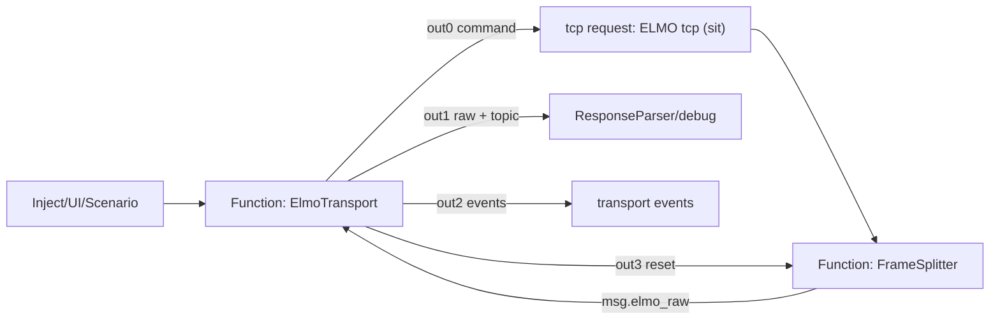

# Текущее состояние XStateMachine ELMO

Актуально на: 2026-05-27.

Этот документ описывает фактическое состояние локальной реализации `nc3-elmo-machines` и интеграции в Node-RED после отладки TCP poll. Старый подробный файл `docs/xstate-machine-architecture.md` остается историческим разбором архитектуры, но текущие нюансы fast polling и диагностики фиксируются здесь.

## Короткий вывод по частоте poll

Настройка `fastRawPollHz` задает целевую частоту логического fast poll. После текущего исправления планировщик считает следующий delay от старта предыдущего fast poll, а не от момента его завершения.

Это важно, потому что fast poll сейчас состоит из нескольких последовательных физических TCP read-команд:

- `fast_seek`: `VX`, `PX`;
- `fast_data`: `VX`, `PX`, `TM`;
- каждая команда идет через один общий TCP request node;
- одновременно может быть только один in-flight request;
- каждый физический ответ собирается `FrameSplitter` через idle gap.

При idle gap `80 ms` верхняя граница частоты без учета TCP/Node-RED overhead:

| Логический poll | Физических read-команд | Потолок при `80 ms` |
|---|---:|---:|
| `VX` | 1 | около `12.5 Hz` |
| `VX/PX` | 2 | около `6.25 Hz` |
| `VX/PX/TM` | 3 | около `4.16 Hz` |

Поэтому измерения:

- запрос `1 Hz` -> фактически около `0.77..0.8 Hz`;
- запрос `10 Hz` -> фактически около `2.5..2.9 Hz`;
- запрос `30 Hz` -> фактически около `3.1..3.2 Hz`;

соответствуют прежнему алгоритму, где после завершения poll дополнительно ждался полный период. После исправления лишний полный период убран, но физический потолок при трех одиночных read-командах и `80 ms` idle gap все равно остается около `4 Hz`.

30 Hz для `VX/PX/TM` в текущей схеме одиночных read-команд недостижимы. Для 30 Hz нужно подтвердить один из вариантов:

1. ELMO стабильно отвечает на batch-запрос `VX;PX;TM;` одним корректным кадром.
2. `FrameSplitter` можно безопасно перевести на существенно меньший idle gap.
3. Можно использовать надежный terminator/признак конца ответа вместо idle-gap ожидания.
4. Можно вынести быстрый raw poll в отдельный специализированный transport, который не ждет `80 ms` после каждого физического регистра.

## Основная роль машины

`ElmoTransport` - это транспортная XStateMachine, а не полная машина технологического процесса центрифуги.

Она делает:

- владеет единственным TCP-каналом к ELMO;
- сериализует команды UI, команды сценария и poll;
- держит только один in-flight request;
- восстанавливает logical topic ответа;
- пересылает raw-ответы дальше в существующий parser/debug;
- генерирует `CMD.ACKED`, `CMD.FAILED`, `POLL.BAD_FRAME`;
- сама планирует poll, когда очередь пуста;
- сбрасывает TCP/FrameSplitter при timeout/fault.

Она не делает:

- не реализует весь сценарий измерения;
- не заменяет основной `ResponseParser`;
- не принимает пользовательские параметры движения из UI напрямую;
- не хранит протокол измерения;
- не управляет UI-состояниями кнопок.

## Интеграция в Node-RED

Интеграция находится во вкладке `ELMO XState (sit)` в `flows.json`.

Поток:



`tcp request` работает в режиме `sit`, поэтому поток байт не приходит как готовые request/response пары. `FrameSplitter` буферизует TCP chunks и отправляет в actor готовый raw frame. На время отладки warn-логи `ElmoTransport` и `FrameSplitter` отключены по умолчанию и должны включаться только явно.

## Очередь и приоритеты

Все операции идут через одну priority queue.

Текущие роли:

| Роль | Приоритет | Назначение |
|---|---:|---|
| `cmd` / init | `3` | пользовательские и сценарные команды |
| `fastPoll` | `2.5` | быстрый raw poll во время записи |
| `tilt` | `2` | команды наклона |
| `poll` | `1` | обычный data/state poll |

Приоритет fast poll ниже команд. Это принципиально: запись данных не должна блокировать команду остановки, смену состояния или подтверждающий full-state poll.

## Poll-роли

### `data`

Обычный data poll:

```text
TM
PX
VX
```

Назначение:

- `TM` - время ELMO;
- `PX` - позиция;
- `VX` - скорость для scheduler и downstream-логики.

Topic наружу: `poll_data`.

### `state`

Минимальный state poll:

```text
MO
SO
SR
```

Назначение:

- `MO` - motor on/off command state;
- `SO` - servo/status ready bit;
- `SR` - status/error register.

Эти поля не нужно постоянно опрашивать с высокой частотой. Они нужны для инициализации, периодической живой диагностики и подтверждения после команд, которые меняют состояние привода.

Topic наружу: `poll_state`.

### `full_state`

Диагностический полный снимок:

```text
MS
MO
SO
SR
AF
OL[1]
OL[2]
```

Назначение:

- инициализация после connect/recover;
- диагностика после невалидных fast-poll кадров;
- подтверждение после команд, которые меняют стабильные состояния;
- ручной inject `full state once`.

`MS`, `AF`, `OL[1]`, `OL[2]` не гоняются постоянно, потому что они не должны самопроизвольно меняться в нормальном сценарии. Разрешение энкодеров и пневмотормоз меняются через контролируемые команды, поэтому их достаточно читать при init и подтверждении.

Topic наружу: `poll_state`.

### `fast_seek`

Быстрый poll до устойчивой скорости:

```text
VX
PX
```

Topic наружу: `poll_fast`.

Этот поток не предназначен для наполнения data-файла. Он нужен, чтобы чаще видеть текущую скорость/позицию до выхода на устойчивый режим.

### `fast_data`

Быстрый raw poll после устойчивой скорости:

```text
VX
PX
TM
```

Topic наружу: `poll_data`.

Это режим для наполнения raw buffer/data-файла во время движения, когда запись включена и включен флаг записи исходных данных.

## Fast raw polling

Fast raw режим включается только через `POLL.CONFIG`.

Условие активности:

```text
fastRawPollingEnabled === true
isRecording === true
(isRecordingRaw === true || rawDataEnabled === true)
```

Настройки:

| Поле | Назначение | Диапазон/дефолт |
|---|---|---|
| `fastRawPollingEnabled` | разрешить fast raw path | `true` по умолчанию |
| `fastRawPollHz` | целевая частота логического fast poll | `1..30`, дефолт `30` |
| `fastStableSamples` | сколько подряд стабильных `VX` нужно | дефолт `3` |
| `fastStableToleranceTicks` | допустимая разница `VX` между samples | дефолт `1000` ticks/s |

Алгоритм:

1. Пока скорость не признана устойчивой, enqueue идет как `fast_seek`.
2. После каждого валидного fast frame машина обновляет `lastFastVx`, `fastStableCount`, `fastStable`.
3. Если `fastStableCount >= fastStableSamples`, следующий fast poll становится `fast_data`.
4. Если fast frame невалидный, машина:
   - эмитит `POLL.BAD_FRAME`;
   - сбрасывает `fastStable`;
   - ставит `full_state` с высоким приоритетом для диагностики.

## Scheduler

Обычный poll:

```text
rate_hz = clamp(abs(omega_deg_s) / 12, 1, 30)
delay_ms = round(1000 / rate_hz)
```

`omega_deg_s` берется из последнего валидного `VX`. Сразу после speed command может использоваться `meta.setpointDegS`, пока не пришел новый `VX`.

Fast raw poll:

```text
target_ms = 1000 / fastRawPollHz
elapsed_ms = now_ms - lastFastPollStartedAt
delay_ms = max(1, round(target_ms - elapsed_ms))
```

Это означает, что настройка `fastRawPollHz` трактуется как start-to-start целевая частота логического fast poll. Если сам poll уже шел дольше целевого периода, следующий poll стартует почти сразу, но не параллельно: single in-flight invariant сохраняется.

## Parser и валидация

Минимальный parser `parseElmoScalars` нужен только для внутренних решений транспорта:

- `TM`, `PX`, `VX` - data/fast data;
- `MS`, `MO`, `SO`, `SR`, `AF`, `OL[1]`, `OL[2]` - state/full state.

Downstream `ResponseParser` по-прежнему получает raw-ответ. Transport parser не является заменой доменного парсера.

Валидация poll проверяет наличие обязательных полей для роли. Если поле отсутствует:

- raw не пересылается как валидный poll;
- наружу уходит `POLL.BAD_FRAME`;
- для fast poll дополнительно ставится `full_state`.

Дубли полей в текущей машине не считаются fatal сами по себе, но в логах ELMO они были важным симптомом склейки/перекрытия ответов.

## Что выявлено отладкой

1. Несколько одновременных TCP-клиентов к ELMO дают смешивание ответов. Должен быть один владелец TCP.
2. Batch `TM;PX;VX;MS;...` давал неполные и смешанные ответы, особенно на state-полях.
3. Разделение poll на одиночные read-команды улучшило валидность, но резко ограничило частоту из-за idle gap после каждой команды.
4. Постоянный опрос `MS/MO/SO/SR/AF/OL[1]/OL[2]` не нужен и вреден для пропускной способности.
5. Для high-rate raw data нужны только `VX/PX` до устойчивой скорости и `VX/PX/TM` после нее.
6. `PollRateMeter` показывает валидные логические frames/sec, а не TCP chunks/sec.
7. При `FrameSplitter idleMs=80` 30 Hz невозможны для трех одиночных read-команд.
8. Для оценки настоящего предела ELMO нужно тестировать C-утилитой режимы `vx`, `fast-seek`, `fast-data`, `batch-seek`, `batch-data`.

## Тестовые inject nodes

В flow добавлены inject/debug nodes для проверки без UI:

- включение normal polling;
- fast raw `1 Hz`;
- fast raw `10 Hz`;
- fast raw `30 Hz`;
- отправка настроек из `global/settings`;
- ручной `POLL.TICK`;
- ручной `full_state once`;
- debug `poll rate (valid frames/sec)`.

Это временный диагностический слой, который нужен пока UI еще не подключает параметры движения и записи к `POLL.CONFIG`.

## Что делать после `git pull` на удаленном хосте

1. Перезапустить Node-RED или redeploy project, чтобы обновились `flows.json` и локальный пакет.
2. Убедиться, что `functionGlobalContext` видит локальный пакет `nc3-elmo-machines`.
3. Если Node-RED запущен как сервис, перезапустить сервис, а не только вкладку браузера.
4. Проверить, что к `192.168.1.2:2000` нет второго TCP-клиента:

```bat
netstat -ano | findstr 192.168.1.2:2000
```

5. Для чистого теста частоты сначала использовать inject nodes, потом отдельно C-утилиту при остановленном Node-RED.

