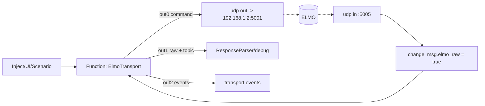

# Текущее состояние XStateMachine ELMO

Актуально на: 2026-05-27 (рефакторинг под UDP).

Этот документ описывает фактическое состояние локальной реализации `nc3-elmo-machines` и интеграции в Node-RED после перехода транспорта с TCP `sit` на UDP. Краткий справочник по файлам и функциям пакета — [xstate-machine-architecture.md](xstate-machine-architecture.md).

## Короткий вывод по частоте poll

Транспорт — **UDP с атомарными командами**. ELMO слушает команды на `192.168.1.2:5001`, ответы приходят на локальный порт `5005` (`udp out` / `udp in`). Стенд подтвердил: ELMO **плохо отвечает на батч** (`TM;PX;VX;`) — даёт одну датаграмму на каждый параметр и порядок/корреляция страдает (фрагменты от предыдущего батча мог попадать в ответ на следующий запрос). Поэтому каждый логический poll отправляется как **последовательность атомарных одно-параметровых команд** (`TM`, потом `PX`, потом `VX`), каждая даёт ровно одну датаграмму-ответ (1:1). Транспорт собирает части в один логический raw для downstream.

Почему это всё равно быстрее TCP:

- TCP `sit` тоже слал атомарные команды, но `FrameSplitter` ждал `80 ms` тишины после каждой → потолок `~4 Hz`;
- UDP-датаграмма — это готовый кадр, ждать тишины не нужно. RTT атомарной команды — единицы миллисекунд, поэтому 3 атомарных команды на data-poll легко укладываются в бюджет 30 Гц (33 мс).

Защита от рассинхрона: каждый атомарный ответ валидируется на ожидаемый параметр (`partRequired`). Любая «чужая» датаграмма (например, остаток от предыдущего батча) даст `POLL.BAD_FRAME` для этой части — целиком логический poll отбрасывается, на следующем тике начинается заново. Самовосстанавливается.

Что осталось проверить на стенде:

1. Достижимая частота с атомарным `VX/PX/TM` (3 RTT на poll). Ожидание — близко к 30 Гц, ограничение скорее в таймере Node-RED/Windows, чем в линке.
2. Точный ровный 30 Гц требует более точного источника тиков, чем `inject` (самотактируемый `setTimeout` транспорта точнее; голый `inject` всегда джиттерит на Windows).

## Основная роль машины

`ElmoTransport` - это транспортная XStateMachine, а не полная машина технологического процесса центрифуги.

Она делает:

- владеет единственным UDP-каналом к ELMO (один отправитель команд);
- сериализует команды UI, команды сценария и poll;
- держит только один in-flight request (1:1 корреляция запрос/ответ, т.к. `udp out`/`udp in` не парные);
- отправляет логический poll как последовательность атомарных одно-параметровых команд и собирает части в один логический raw;
- восстанавливает logical topic ответа;
- пересылает raw-ответы дальше в существующий parser/debug;
- генерирует `CMD.ACKED`, `CMD.FAILED`, `POLL.BAD_FRAME`;
- сама планирует poll, когда очередь пуста;
- при таймауте ответа освобождает in-flight и продолжает опрос; уходит в `offline` только после `maxMisses` подряд пропущенных ответов (затем сам перезапрашивает probe). Сокет не сбрасывается — в UDP его нет.

Она не делает:

- не реализует весь сценарий измерения;
- не заменяет основной `ResponseParser`;
- не принимает пользовательские параметры движения из UI напрямую;
- не хранит протокол измерения;
- не управляет UI-состояниями кнопок.

## Интеграция в Node-RED

Интеграция находится во вкладке `ELMO XState (UDP)` в `flows.json`. Генератор-эквивалент: `flows/elmo-xstate-udp/build-flow.js` (canonical-артефакт всё равно `flows.json`).

Поток:



`udp in` отдаёт каждую датаграмму как готовый кадр, поэтому `FrameSplitter` удалён. Маленький `change`-узел помечает входящую датаграмму как `msg.elmo_raw = true`, после чего транспорт принимает её как `ELMO.RESP`. На время отладки warn-логи `ElmoTransport` отключены по умолчанию (`context.transportDebug`) и должны включаться только явно.

## Очередь и приоритеты

Все операции идут через одну priority queue.

Текущие роли:

| Роль | Приоритет | Назначение |
|---|---:|---|
| `cmd` / init | `3` | пользовательские и сценарные команды |
| `fastPoll` | `2.5` | быстрый raw poll во время записи |
| `tilt` | `2` | команды наклона |
| `poll` | `1` | обычный data/state poll |

Приоритет fast poll ниже команд. Это принципиально: запись данных не должна блокировать команду остановки, смену состояния или подтверждающий full-state poll.

## Poll-роли

### `data`

Обычный data poll:

```text
TM
PX
VX
```

Назначение:

- `TM` - время ELMO;
- `PX` - позиция;
- `VX` - скорость для scheduler и downstream-логики.

Topic наружу: `poll_data`.

### `state`

Минимальный state poll:

```text
MO
SO
SR
```

Назначение:

- `MO` - motor on/off command state;
- `SO` - servo/status ready bit;
- `SR` - status/error register.

Эти поля не нужно постоянно опрашивать с высокой частотой. Они нужны для инициализации, периодической живой диагностики и подтверждения после команд, которые меняют состояние привода.

Topic наружу: `poll_state`.

### `full_state`

Диагностический полный снимок:

```text
MS
MO
SO
SR
AF
OL[1]
OL[2]
```

Назначение:

- инициализация после connect/recover;
- диагностика после невалидных fast-poll кадров;
- подтверждение после команд, которые меняют стабильные состояния;
- ручной inject `full state once`.

`MS`, `AF`, `OL[1]`, `OL[2]` не гоняются постоянно, потому что они не должны самопроизвольно меняться в нормальном сценарии. Разрешение энкодеров и пневмотормоз меняются через контролируемые команды, поэтому их достаточно читать при init и подтверждении.

Topic наружу: `poll_state`.

### `fast_seek`

Быстрый poll до устойчивой скорости:

```text
VX
PX
```

Topic наружу: `poll_fast`.

Этот поток не предназначен для наполнения data-файла. Он нужен, чтобы чаще видеть текущую скорость/позицию до выхода на устойчивый режим.

### `fast_data`

Быстрый raw poll после устойчивой скорости:

```text
VX
PX
TM
```

Topic наружу: `poll_data`.

Это режим для наполнения raw buffer/data-файла во время движения, когда запись включена и включен флаг записи исходных данных.

## Fast raw polling

Fast raw режим включается только через `POLL.CONFIG`.

Условие активности:

```text
fastRawPollingEnabled === true
isRecording === true
(isRecordingRaw === true || rawDataEnabled === true)
```

Настройки:

| Поле | Назначение | Диапазон/дефолт |
|---|---|---|
| `fastRawPollingEnabled` | разрешить fast raw path | `true` по умолчанию |
| `fastRawPollHz` | целевая частота логического fast poll | `1..30`, дефолт `30` |
| `fastStableSamples` | сколько подряд стабильных `VX` нужно | дефолт `3` |
| `fastStableToleranceTicks` | допустимая разница `VX` между samples | дефолт `1000` ticks/s |

Алгоритм:

1. Пока скорость не признана устойчивой, enqueue идет как `fast_seek`.
2. После каждого валидного fast frame машина обновляет `lastFastVx`, `fastStableCount`, `fastStable`.
3. Если `fastStableCount >= fastStableSamples`, следующий fast poll становится `fast_data`.
4. Если fast frame невалидный, машина:
   - эмитит `POLL.BAD_FRAME`;
   - сбрасывает `fastStable`;
   - ставит `full_state` с высоким приоритетом для диагностики.

## Scheduler

Обычный poll:

```text
rate_hz = clamp(abs(omega_deg_s) / 12, 1, 30)
delay_ms = round(1000 / rate_hz)
```

`omega_deg_s` берется из последнего валидного `VX`. Сразу после speed command может использоваться `meta.setpointDegS`, пока не пришел новый `VX`.

Fast raw poll:

```text
target_ms = 1000 / fastRawPollHz
elapsed_ms = now_ms - lastFastPollStartedAt
delay_ms = max(1, round(target_ms - elapsed_ms))
```

Это означает, что настройка `fastRawPollHz` трактуется как start-to-start целевая частота логического fast poll. Если сам poll уже шел дольше целевого периода, следующий poll стартует почти сразу, но не параллельно: single in-flight invariant сохраняется.

## Parser и валидация

Минимальный parser `parseElmoScalars` нужен только для внутренних решений транспорта:

- `TM`, `PX`, `VX` - data/fast data;
- `MS`, `MO`, `SO`, `SR`, `AF`, `OL[1]`, `OL[2]` - state/full state.

Downstream `ResponseParser` по-прежнему получает raw-ответ. Transport parser не является заменой доменного парсера.

Валидация poll проверяет наличие обязательных полей для роли. Если поле отсутствует:

- raw не пересылается как валидный poll;
- наружу уходит `POLL.BAD_FRAME`;
- для fast poll дополнительно ставится `full_state`.

Дубли полей в текущей машине не считаются fatal сами по себе, но в логах ELMO они были важным симптомом склейки/перекрытия ответов.

## Что выявлено отладкой

1. По TCP не удалось превысить ~4 Гц: один логический poll слался как несколько одиночных read-команд, и `FrameSplitter` ждал `80 ms` тишины после каждой. Это и стало причиной перехода на UDP.
2. Должен быть **один владелец канала** к ELMO: несколько одновременных клиентов дают смешивание ответов (актуально и для UDP — единый `udp out`).
3. По UDP логический poll = последовательность **атомарных** одно-параметровых команд (`TM`, потом `PX`, потом `VX`); каждая даёт ровно одну датаграмму-ответ, транспорт собирает части в один логический raw. Idle-gap и `FrameSplitter` убраны.
4. **Стенд: ELMO плохо отвечает на батч** `TM;PX;VX;` — даёт одну датаграмму на параметр, иногда не в порядке. Видно было по `POLL.BAD_FRAME` с raw вроде `PX;...` на запрос `MO;SO;SR;` (остаток предыдущего батча). Поэтому переход на атомарные команды.
5. Постоянный опрос `MS/MO/SO/SR/AF/OL[1]/OL[2]` не нужен и вреден для пропускной способности.
6. Для high-rate raw data нужны только `VX/PX` до устойчивой скорости и `VX/PX/TM` после нее.
7. `PollRateMeter` показывает валидные логические frames/sec.
8. Замер inject-теста по UDP (одиночное `TM;`): ~24.7 Гц, ограничение — таймер `inject`/`setInterval` на Windows (~15.6 мс), не ELMO и не UDP. Потерь датаграмм не наблюдалось.

## Тестовые inject nodes

В flow добавлены inject/debug nodes для проверки без UI:

- включение normal polling;
- fast raw `1 Hz`;
- fast raw `10 Hz`;
- fast raw `30 Hz`;
- отправка настроек из `global/settings`;
- ручной `POLL.TICK`;
- ручной `full_state once`;
- debug `poll rate (valid frames/sec)`.

Это временный диагностический слой, который нужен пока UI еще не подключает параметры движения и записи к `POLL.CONFIG`.

## Что делать после `git pull` на удаленном хосте

1. Перезапустить Node-RED или redeploy project, чтобы обновились `flows.json` и локальный пакет.
2. Убедиться, что `functionGlobalContext` видит локальный пакет `nc3-elmo-machines`.
3. Если Node-RED запущен как сервис, перезапустить сервис, а не только вкладку браузера.
4. Убедиться, что локальный порт `5005` свободен и его слушает только `udp in` этого flow (нет второго клиента ELMO):

```bat
netstat -ano | findstr :5005
```

5. Для чистого теста частоты сначала использовать inject nodes (`poll mode: raw fast 30Hz`, debug `poll rate`), потом при необходимости отдельную пробу при остановленном Node-RED.

